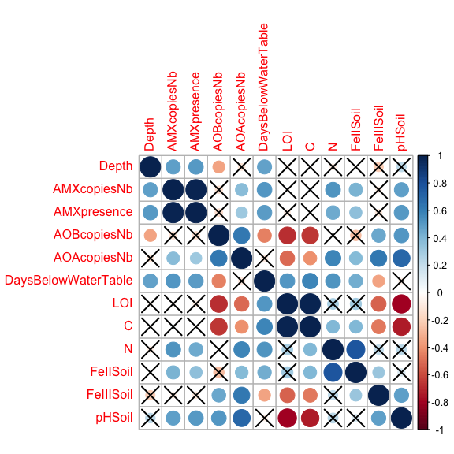
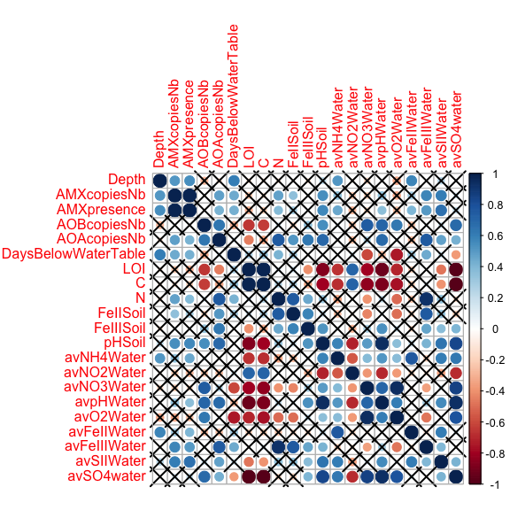
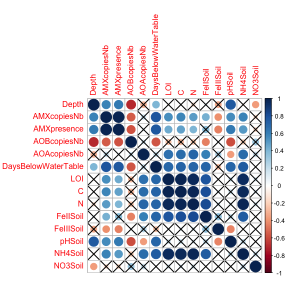
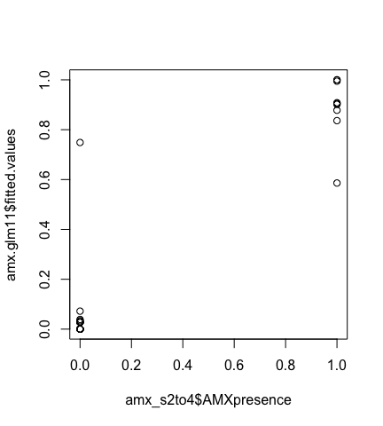
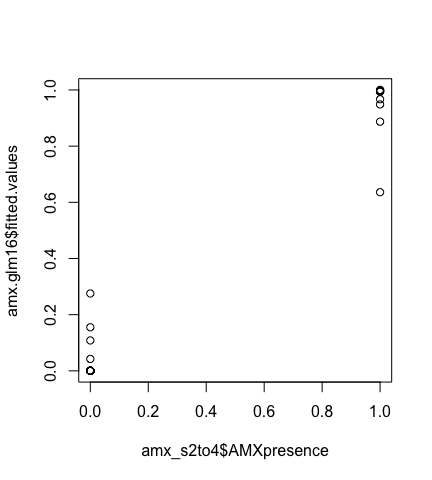
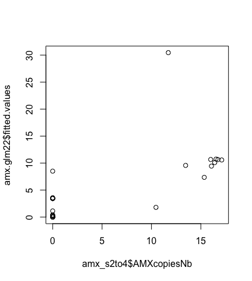
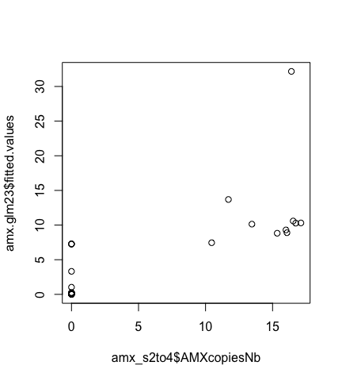
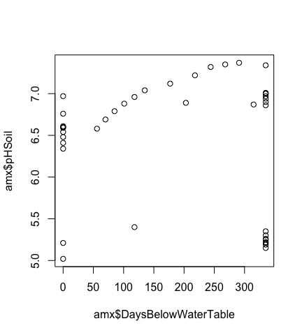
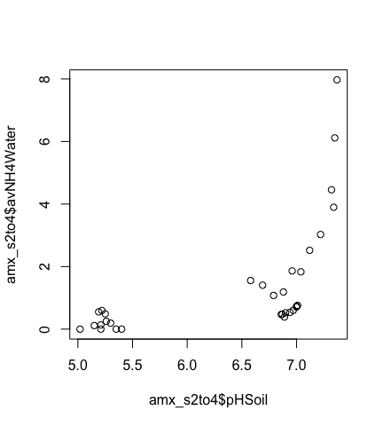
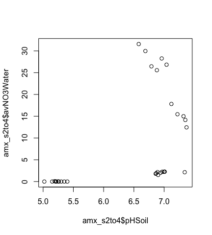

# Script with complete output
Alexandre Bagnoud  
06/01/2017  

#### 1) Load the data set into R


```r
amx <- read.csv("amx_matrix.csv", header = TRUE)
```

#### 2) Log-transform abundance data


```r
amx$AMXcopiesNb <- log(amx$AMXcopiesNb + 1)
amx$AOBcopiesNb <- log(amx$AOBcopiesNb + 1)
amx$AOAcopiesNb <- log(amx$AOAcopiesNb + 1)
```

#### 3) Subset complete data sets from the dataframe (without any NAs)


```r
# Soils 1 to 4:
amx_s1to4 <- amx[, 3:14]

# Soils 2 to 4:
amx_s2to4 <- amx[10:41, c(3:14, 17:25)]

# Soils 1 to 3:
amx_s1to3 <- amx[1:30, 3:16]
```

#### 4) Correlation between variables

##### Correlation matrix

Here, we want to see which variables are correlated with ```AMXPresence``` and ```AMXcopiesNb```, in order to try to explain the distribution of anammox bacteria in this soil system.


```r
library(Hmisc)

rcorr(as.matrix(amx[3:25]))
```

```
##                     Depth AMXcopiesNb AMXpresence AOBcopiesNb AOAcopiesNb
## Depth                1.00        0.48        0.51       -0.34       -0.11
## AMXcopiesNb          0.48        1.00        0.99       -0.13        0.38
## AMXpresence          0.51        0.99        1.00       -0.14        0.31
## AOBcopiesNb         -0.34       -0.13       -0.14        1.00        0.63
## AOAcopiesNb         -0.11        0.38        0.31        0.63        1.00
## DaysBelowWaterTable  0.48        0.51        0.50       -0.44       -0.10
## LOI                 -0.04       -0.04       -0.09       -0.68       -0.50
## C                   -0.02        0.05       -0.01       -0.66       -0.41
## N                   -0.09        0.53        0.45        0.00        0.58
## FeIISoil            -0.01        0.42        0.36       -0.26        0.39
## FeIIISoil           -0.21       -0.08       -0.11        0.45        0.62
## pHSoil               0.22        0.48        0.50        0.51        0.70
## NH4Soil             -0.06        0.59        0.51       -0.20        0.68
## NO3Soil             -0.37       -0.15       -0.15        0.33        0.20
## avNH4Water           0.51        0.34        0.46        0.09       -0.06
## avNO2Water          -0.07       -0.23       -0.29       -0.24       -0.26
## avNO3Water          -0.17       -0.21       -0.16        0.74        0.23
## avpHWater           -0.02        0.34        0.37        0.70        0.69
## avO2Water           -0.33       -0.33       -0.27        0.63        0.05
## avFeIIWater          0.58        0.30        0.41       -0.26       -0.26
## avFeIIIWater        -0.02        0.57        0.51        0.08        0.75
## avSIIWater           0.24        0.60        0.65        0.16        0.48
## avSO4water           0.04        0.14        0.20        0.69        0.43
##                     DaysBelowWaterTable   LOI     C     N FeIISoil
## Depth                              0.48 -0.04 -0.02 -0.09    -0.01
## AMXcopiesNb                        0.51 -0.04  0.05  0.53     0.42
## AMXpresence                        0.50 -0.09 -0.01  0.45     0.36
## AOBcopiesNb                       -0.44 -0.68 -0.66  0.00    -0.26
## AOAcopiesNb                       -0.10 -0.50 -0.41  0.58     0.39
## DaysBelowWaterTable                1.00  0.52  0.57  0.53     0.44
## LOI                                0.52  1.00  0.99  0.28     0.30
## C                                  0.57  0.99  1.00  0.39     0.39
## N                                  0.53  0.28  0.39  1.00     0.78
## FeIISoil                           0.44  0.30  0.39  0.78     1.00
## FeIIISoil                         -0.34 -0.52 -0.46  0.22     0.33
## pHSoil                            -0.07 -0.80 -0.73  0.24     0.13
## NH4Soil                            0.75  0.96  0.96  0.98     0.75
## NO3Soil                            0.02  0.13  0.12  0.14     0.02
## avNH4Water                         0.00 -0.66 -0.68 -0.34    -0.27
## avNO2Water                         0.13  0.71  0.71  0.05    -0.07
## avNO3Water                        -0.61 -0.79 -0.83 -0.39    -0.43
## avpHWater                         -0.27 -0.93 -0.88  0.20     0.07
## avO2Water                         -0.75 -0.70 -0.77 -0.51    -0.49
## avFeIIWater                        0.31 -0.20 -0.21 -0.24    -0.16
## avFeIIIWater                       0.45 -0.04  0.10  0.92     0.76
## avSIIWater                         0.15 -0.47 -0.40  0.35     0.33
## avSO4water                        -0.38 -0.98 -0.98 -0.15    -0.20
##                     FeIIISoil pHSoil NH4Soil NO3Soil avNH4Water avNO2Water
## Depth                   -0.21   0.22   -0.06   -0.37       0.51      -0.07
## AMXcopiesNb             -0.08   0.48    0.59   -0.15       0.34      -0.23
## AMXpresence             -0.11   0.50    0.51   -0.15       0.46      -0.29
## AOBcopiesNb              0.45   0.51   -0.20    0.33       0.09      -0.24
## AOAcopiesNb              0.62   0.70    0.68    0.20      -0.06      -0.26
## DaysBelowWaterTable     -0.34  -0.07    0.75    0.02       0.00       0.13
## LOI                     -0.52  -0.80    0.96    0.13      -0.66       0.71
## C                       -0.46  -0.73    0.96    0.12      -0.68       0.71
## N                        0.22   0.24    0.98    0.14      -0.34       0.05
## FeIISoil                 0.33   0.13    0.75    0.02      -0.27      -0.07
## FeIIISoil                1.00   0.49   -0.02   -0.01       0.09      -0.29
## pHSoil                   0.49   1.00    0.19   -0.03       0.59      -0.71
## NH4Soil                 -0.02   0.19    1.00    0.19      -0.58       0.55
## NO3Soil                 -0.01  -0.03    0.19    1.00      -0.28       0.61
## avNH4Water               0.09   0.59   -0.58   -0.28       1.00      -0.56
## avNO2Water              -0.29  -0.71    0.55    0.61      -0.56       1.00
## avNO3Water               0.28   0.49   -0.77    0.58       0.39      -0.38
## avpHWater                0.54   0.95   -0.88    0.47       0.51      -0.69
## avO2Water                0.16   0.36   -0.80    0.57       0.38      -0.38
## avFeIIWater             -0.15   0.18   -0.23   -0.36       0.77      -0.17
## avFeIIIWater             0.46   0.42    0.86   -0.23      -0.19      -0.12
## avSIIWater               0.37   0.65    0.24   -0.09       0.60      -0.34
## avSO4water               0.40   0.84   -0.96    0.30       0.63      -0.68
##                     avNO3Water avpHWater avO2Water avFeIIWater
## Depth                    -0.17     -0.02     -0.33        0.58
## AMXcopiesNb              -0.21      0.34     -0.33        0.30
## AMXpresence              -0.16      0.37     -0.27        0.41
## AOBcopiesNb               0.74      0.70      0.63       -0.26
## AOAcopiesNb               0.23      0.69      0.05       -0.26
## DaysBelowWaterTable      -0.61     -0.27     -0.75        0.31
## LOI                      -0.79     -0.93     -0.70       -0.20
## C                        -0.83     -0.88     -0.77       -0.21
## N                        -0.39      0.20     -0.51       -0.24
## FeIISoil                 -0.43      0.07     -0.49       -0.16
## FeIIISoil                 0.28      0.54      0.16       -0.15
## pHSoil                    0.49      0.95      0.36        0.18
## NH4Soil                  -0.77     -0.88     -0.80       -0.23
## NO3Soil                   0.58      0.47      0.57       -0.36
## avNH4Water                0.39      0.51      0.38        0.77
## avNO2Water               -0.38     -0.69     -0.38       -0.17
## avNO3Water                1.00      0.70      0.94       -0.08
## avpHWater                 0.70      1.00      0.60        0.03
## avO2Water                 0.94      0.60      1.00       -0.08
## avFeIIWater              -0.08      0.03     -0.08        1.00
## avFeIIIWater             -0.36      0.28     -0.47       -0.13
## avSIIWater                0.12      0.56      0.05        0.61
## avSO4water                0.86      0.93      0.79        0.11
##                     avFeIIIWater avSIIWater avSO4water
## Depth                      -0.02       0.24       0.04
## AMXcopiesNb                 0.57       0.60       0.14
## AMXpresence                 0.51       0.65       0.20
## AOBcopiesNb                 0.08       0.16       0.69
## AOAcopiesNb                 0.75       0.48       0.43
## DaysBelowWaterTable         0.45       0.15      -0.38
## LOI                        -0.04      -0.47      -0.98
## C                           0.10      -0.40      -0.98
## N                           0.92       0.35      -0.15
## FeIISoil                    0.76       0.33      -0.20
## FeIIISoil                   0.46       0.37       0.40
## pHSoil                      0.42       0.65       0.84
## NH4Soil                     0.86       0.24      -0.96
## NO3Soil                    -0.23      -0.09       0.30
## avNH4Water                 -0.19       0.60       0.63
## avNO2Water                 -0.12      -0.34      -0.68
## avNO3Water                 -0.36       0.12       0.86
## avpHWater                   0.28       0.56       0.93
## avO2Water                  -0.47       0.05       0.79
## avFeIIWater                -0.13       0.61       0.11
## avFeIIIWater                1.00       0.39      -0.05
## avSIIWater                  0.39       1.00       0.41
## avSO4water                 -0.05       0.41       1.00
## 
## n
##                     Depth AMXcopiesNb AMXpresence AOBcopiesNb AOAcopiesNb
## Depth                  41          41          41          41          41
## AMXcopiesNb            41          41          41          41          41
## AMXpresence            41          41          41          41          41
## AOBcopiesNb            41          41          41          41          41
## AOAcopiesNb            41          41          41          41          41
## DaysBelowWaterTable    41          41          41          41          41
## LOI                    41          41          41          41          41
## C                      41          41          41          41          41
## N                      41          41          41          41          41
## FeIISoil               41          41          41          41          41
## FeIIISoil              41          41          41          41          41
## pHSoil                 41          41          41          41          41
## NH4Soil                30          30          30          30          30
## NO3Soil                30          30          30          30          30
## avNH4Water             32          32          32          32          32
## avNO2Water             32          32          32          32          32
## avNO3Water             32          32          32          32          32
## avpHWater              32          32          32          32          32
## avO2Water              32          32          32          32          32
## avFeIIWater            32          32          32          32          32
## avFeIIIWater           32          32          32          32          32
## avSIIWater             32          32          32          32          32
## avSO4water             32          32          32          32          32
##                     DaysBelowWaterTable LOI  C  N FeIISoil FeIIISoil
## Depth                                41  41 41 41       41        41
## AMXcopiesNb                          41  41 41 41       41        41
## AMXpresence                          41  41 41 41       41        41
## AOBcopiesNb                          41  41 41 41       41        41
## AOAcopiesNb                          41  41 41 41       41        41
## DaysBelowWaterTable                  41  41 41 41       41        41
## LOI                                  41  41 41 41       41        41
## C                                    41  41 41 41       41        41
## N                                    41  41 41 41       41        41
## FeIISoil                             41  41 41 41       41        41
## FeIIISoil                            41  41 41 41       41        41
## pHSoil                               41  41 41 41       41        41
## NH4Soil                              30  30 30 30       30        30
## NO3Soil                              30  30 30 30       30        30
## avNH4Water                           32  32 32 32       32        32
## avNO2Water                           32  32 32 32       32        32
## avNO3Water                           32  32 32 32       32        32
## avpHWater                            32  32 32 32       32        32
## avO2Water                            32  32 32 32       32        32
## avFeIIWater                          32  32 32 32       32        32
## avFeIIIWater                         32  32 32 32       32        32
## avSIIWater                           32  32 32 32       32        32
## avSO4water                           32  32 32 32       32        32
##                     pHSoil NH4Soil NO3Soil avNH4Water avNO2Water
## Depth                   41      30      30         32         32
## AMXcopiesNb             41      30      30         32         32
## AMXpresence             41      30      30         32         32
## AOBcopiesNb             41      30      30         32         32
## AOAcopiesNb             41      30      30         32         32
## DaysBelowWaterTable     41      30      30         32         32
## LOI                     41      30      30         32         32
## C                       41      30      30         32         32
## N                       41      30      30         32         32
## FeIISoil                41      30      30         32         32
## FeIIISoil               41      30      30         32         32
## pHSoil                  41      30      30         32         32
## NH4Soil                 30      30      30         21         21
## NO3Soil                 30      30      30         21         21
## avNH4Water              32      21      21         32         32
## avNO2Water              32      21      21         32         32
## avNO3Water              32      21      21         32         32
## avpHWater               32      21      21         32         32
## avO2Water               32      21      21         32         32
## avFeIIWater             32      21      21         32         32
## avFeIIIWater            32      21      21         32         32
## avSIIWater              32      21      21         32         32
## avSO4water              32      21      21         32         32
##                     avNO3Water avpHWater avO2Water avFeIIWater
## Depth                       32        32        32          32
## AMXcopiesNb                 32        32        32          32
## AMXpresence                 32        32        32          32
## AOBcopiesNb                 32        32        32          32
## AOAcopiesNb                 32        32        32          32
## DaysBelowWaterTable         32        32        32          32
## LOI                         32        32        32          32
## C                           32        32        32          32
## N                           32        32        32          32
## FeIISoil                    32        32        32          32
## FeIIISoil                   32        32        32          32
## pHSoil                      32        32        32          32
## NH4Soil                     21        21        21          21
## NO3Soil                     21        21        21          21
## avNH4Water                  32        32        32          32
## avNO2Water                  32        32        32          32
## avNO3Water                  32        32        32          32
## avpHWater                   32        32        32          32
## avO2Water                   32        32        32          32
## avFeIIWater                 32        32        32          32
## avFeIIIWater                32        32        32          32
## avSIIWater                  32        32        32          32
## avSO4water                  32        32        32          32
##                     avFeIIIWater avSIIWater avSO4water
## Depth                         32         32         32
## AMXcopiesNb                   32         32         32
## AMXpresence                   32         32         32
## AOBcopiesNb                   32         32         32
## AOAcopiesNb                   32         32         32
## DaysBelowWaterTable           32         32         32
## LOI                           32         32         32
## C                             32         32         32
## N                             32         32         32
## FeIISoil                      32         32         32
## FeIIISoil                     32         32         32
## pHSoil                        32         32         32
## NH4Soil                       21         21         21
## NO3Soil                       21         21         21
## avNH4Water                    32         32         32
## avNO2Water                    32         32         32
## avNO3Water                    32         32         32
## avpHWater                     32         32         32
## avO2Water                     32         32         32
## avFeIIWater                   32         32         32
## avFeIIIWater                  32         32         32
## avSIIWater                    32         32         32
## avSO4water                    32         32         32
## 
## P
##                     Depth  AMXcopiesNb AMXpresence AOBcopiesNb AOAcopiesNb
## Depth                      0.0014      0.0007      0.0280      0.4865     
## AMXcopiesNb         0.0014             0.0000      0.4150      0.0149     
## AMXpresence         0.0007 0.0000                  0.3746      0.0474     
## AOBcopiesNb         0.0280 0.4150      0.3746                  0.0000     
## AOAcopiesNb         0.4865 0.0149      0.0474      0.0000                 
## DaysBelowWaterTable 0.0016 0.0007      0.0009      0.0037      0.5353     
## LOI                 0.7840 0.8105      0.5828      0.0000      0.0008     
## C                   0.9103 0.7513      0.9617      0.0000      0.0083     
## N                   0.5925 0.0004      0.0035      0.9786      0.0000     
## FeIISoil            0.9723 0.0064      0.0225      0.0953      0.0122     
## FeIIISoil           0.1875 0.6185      0.4983      0.0031      0.0000     
## pHSoil              0.1601 0.0014      0.0008      0.0006      0.0000     
## NH4Soil             0.7548 0.0006      0.0042      0.2813      0.0000     
## NO3Soil             0.0450 0.4430      0.4179      0.0786      0.2791     
## avNH4Water          0.0026 0.0560      0.0087      0.6233      0.7534     
## avNO2Water          0.7200 0.2108      0.1136      0.1877      0.1441     
## avNO3Water          0.3387 0.2584      0.3714      0.0000      0.2025     
## avpHWater           0.8975 0.0537      0.0382      0.0000      0.0000     
## avO2Water           0.0677 0.0685      0.1412      0.0001      0.7727     
## avFeIIWater         0.0005 0.0977      0.0212      0.1584      0.1530     
## avFeIIIWater        0.9186 0.0006      0.0032      0.6785      0.0000     
## avSIIWater          0.1769 0.0002      0.0000      0.3849      0.0059     
## avSO4water          0.8375 0.4399      0.2743      0.0000      0.0147     
##                     DaysBelowWaterTable LOI    C      N      FeIISoil
## Depth               0.0016              0.7840 0.9103 0.5925 0.9723  
## AMXcopiesNb         0.0007              0.8105 0.7513 0.0004 0.0064  
## AMXpresence         0.0009              0.5828 0.9617 0.0035 0.0225  
## AOBcopiesNb         0.0037              0.0000 0.0000 0.9786 0.0953  
## AOAcopiesNb         0.5353              0.0008 0.0083 0.0000 0.0122  
## DaysBelowWaterTable                     0.0005 0.0000 0.0004 0.0044  
## LOI                 0.0005                     0.0000 0.0770 0.0561  
## C                   0.0000              0.0000        0.0115 0.0108  
## N                   0.0004              0.0770 0.0115        0.0000  
## FeIISoil            0.0044              0.0561 0.0108 0.0000         
## FeIIISoil           0.0293              0.0004 0.0022 0.1740 0.0360  
## pHSoil              0.6541              0.0000 0.0000 0.1314 0.4257  
## NH4Soil             0.0000              0.0000 0.0000 0.0000 0.0000  
## NO3Soil             0.9163              0.5093 0.5401 0.4735 0.9252  
## avNH4Water          0.9943              0.0000 0.0000 0.0599 0.1403  
## avNO2Water          0.4627              0.0000 0.0000 0.8011 0.7190  
## avNO3Water          0.0002              0.0000 0.0000 0.0259 0.0138  
## avpHWater           0.1348              0.0000 0.0000 0.2756 0.6860  
## avO2Water           0.0000              0.0000 0.0000 0.0030 0.0042  
## avFeIIWater         0.0855              0.2784 0.2502 0.1865 0.3910  
## avFeIIIWater        0.0107              0.8355 0.5691 0.0000 0.0000  
## avSIIWater          0.3970              0.0066 0.0237 0.0502 0.0638  
## avSO4water          0.0322              0.0000 0.0000 0.4104 0.2609  
##                     FeIIISoil pHSoil NH4Soil NO3Soil avNH4Water avNO2Water
## Depth               0.1875    0.1601 0.7548  0.0450  0.0026     0.7200    
## AMXcopiesNb         0.6185    0.0014 0.0006  0.4430  0.0560     0.2108    
## AMXpresence         0.4983    0.0008 0.0042  0.4179  0.0087     0.1136    
## AOBcopiesNb         0.0031    0.0006 0.2813  0.0786  0.6233     0.1877    
## AOAcopiesNb         0.0000    0.0000 0.0000  0.2791  0.7534     0.1441    
## DaysBelowWaterTable 0.0293    0.6541 0.0000  0.9163  0.9943     0.4627    
## LOI                 0.0004    0.0000 0.0000  0.5093  0.0000     0.0000    
## C                   0.0022    0.0000 0.0000  0.5401  0.0000     0.0000    
## N                   0.1740    0.1314 0.0000  0.4735  0.0599     0.8011    
## FeIISoil            0.0360    0.4257 0.0000  0.9252  0.1403     0.7190    
## FeIIISoil                     0.0012 0.9071  0.9401  0.6315     0.1059    
## pHSoil              0.0012           0.3064  0.8748  0.0004     0.0000    
## NH4Soil             0.9071    0.3064         0.3196  0.0059     0.0092    
## NO3Soil             0.9401    0.8748 0.3196          0.2239     0.0031    
## avNH4Water          0.6315    0.0004 0.0059  0.2239             0.0009    
## avNO2Water          0.1059    0.0000 0.0092  0.0031  0.0009               
## avNO3Water          0.1236    0.0040 0.0000  0.0064  0.0274     0.0304    
## avpHWater           0.0014    0.0000 0.0000  0.0315  0.0028     0.0000    
## avO2Water           0.3708    0.0420 0.0000  0.0070  0.0325     0.0336    
## avFeIIWater         0.4105    0.3361 0.3109  0.1109  0.0000     0.3586    
## avFeIIIWater        0.0074    0.0177 0.0000  0.3244  0.2851     0.5260    
## avSIIWater          0.0367    0.0000 0.2968  0.7066  0.0003     0.0540    
## avSO4water          0.0226    0.0000 0.0000  0.1836  0.0001     0.0000    
##                     avNO3Water avpHWater avO2Water avFeIIWater
## Depth               0.3387     0.8975    0.0677    0.0005     
## AMXcopiesNb         0.2584     0.0537    0.0685    0.0977     
## AMXpresence         0.3714     0.0382    0.1412    0.0212     
## AOBcopiesNb         0.0000     0.0000    0.0001    0.1584     
## AOAcopiesNb         0.2025     0.0000    0.7727    0.1530     
## DaysBelowWaterTable 0.0002     0.1348    0.0000    0.0855     
## LOI                 0.0000     0.0000    0.0000    0.2784     
## C                   0.0000     0.0000    0.0000    0.2502     
## N                   0.0259     0.2756    0.0030    0.1865     
## FeIISoil            0.0138     0.6860    0.0042    0.3910     
## FeIIISoil           0.1236     0.0014    0.3708    0.4105     
## pHSoil              0.0040     0.0000    0.0420    0.3361     
## NH4Soil             0.0000     0.0000    0.0000    0.3109     
## NO3Soil             0.0064     0.0315    0.0070    0.1109     
## avNH4Water          0.0274     0.0028    0.0325    0.0000     
## avNO2Water          0.0304     0.0000    0.0336    0.3586     
## avNO3Water                     0.0000    0.0000    0.6598     
## avpHWater           0.0000               0.0003    0.8570     
## avO2Water           0.0000     0.0003              0.6511     
## avFeIIWater         0.6598     0.8570    0.6511               
## avFeIIIWater        0.0453     0.1198    0.0062    0.4786     
## avSIIWater          0.5218     0.0009    0.7716    0.0002     
## avSO4water          0.0000     0.0000    0.0000    0.5516     
##                     avFeIIIWater avSIIWater avSO4water
## Depth               0.9186       0.1769     0.8375    
## AMXcopiesNb         0.0006       0.0002     0.4399    
## AMXpresence         0.0032       0.0000     0.2743    
## AOBcopiesNb         0.6785       0.3849     0.0000    
## AOAcopiesNb         0.0000       0.0059     0.0147    
## DaysBelowWaterTable 0.0107       0.3970     0.0322    
## LOI                 0.8355       0.0066     0.0000    
## C                   0.5691       0.0237     0.0000    
## N                   0.0000       0.0502     0.4104    
## FeIISoil            0.0000       0.0638     0.2609    
## FeIIISoil           0.0074       0.0367     0.0226    
## pHSoil              0.0177       0.0000     0.0000    
## NH4Soil             0.0000       0.2968     0.0000    
## NO3Soil             0.3244       0.7066     0.1836    
## avNH4Water          0.2851       0.0003     0.0001    
## avNO2Water          0.5260       0.0540     0.0000    
## avNO3Water          0.0453       0.5218     0.0000    
## avpHWater           0.1198       0.0009     0.0000    
## avO2Water           0.0062       0.7716     0.0000    
## avFeIIWater         0.4786       0.0002     0.5516    
## avFeIIIWater                     0.0253     0.8023    
## avSIIWater          0.0253                  0.0190    
## avSO4water          0.8023       0.0190
```

* ```AMXpresence``` and ```AMXcopiesNb``` are both correlated with ```DaysBelowWaterTable```, ```pHSoil```, ```N```, ```avNH4Water```, ```avFeIIIWater```, ```avSIIWater```, and ```NH4Soil``` (besides ```avDepth```, and ```AOAcopiesNb```).

The best candidate variables for explaning anammox distribution in this soil system are ```DaysBelowWaterTable```, ```pHSoil``` and ```N```, as they are the most correlated variable with ```AMXpresence``` and ```AMXcopiesNb```. Let's use them to fit a model that explains anammox distribution in this soil system

##### Correlation plots

Correlation plot from these 3 data sets. Non-signifcant correlations (p-value > 0.01) are crossed.


```r
library(corrplot)

# cor.mtest function from:
# http://www.sthda.com/french/wiki/matrice-de-correlation-guide-simple-pour-analyser-formater-et-visualiser

cor.mtest <- function(mat, conf.level = 0.95){
  mat <- as.matrix(mat)
    n <- ncol(mat)
    p.mat <- lowCI.mat <- uppCI.mat <- matrix(NA, n, n)
    diag(p.mat) <- 0
    diag(lowCI.mat) <- diag(uppCI.mat) <- 1
    for(i in 1:(n-1)){
        for(j in (i+1):n){
            tmp <- cor.test(mat[,i], mat[,j], conf.level = conf.level)
            p.mat[i,j] <- p.mat[j,i] <- tmp$p.value
            lowCI.mat[i,j] <- lowCI.mat[j,i] <- tmp$conf.int[1]
            uppCI.mat[i,j] <- uppCI.mat[j,i] <- tmp$conf.int[2]
        }
    }
    return(list(p.mat, lowCI.mat, uppCI.mat))
}

# Soils 1 to 4 (n = 41):
mcor_s1to4 <- cor(amx_s1to4, method = c("pearson"))
res_s1to4 <- cor.mtest(amx_s1to4,0.99)
corrplot(mcor_s1to4, p.mat = res_s1to4[[1]], sig.level=0.05, addrect=6, tl.cex=1)
```

<!-- -->

```r
# Soils 2 to 4 (n = 32):
mcor_s2to4 <- cor(amx_s2to4, method = c("pearson"))
res_s2to4 <- cor.mtest(amx_s2to4,0.99)
corrplot(mcor_s2to4, p.mat = res_s2to4[[1]], sig.level=0.05, addrect=6, tl.cex=1)
```

<!-- -->

```r
# Soils 1 to 3 (n = 30):
mcor_s1to3 <- cor(amx_s1to3, method = c("pearson"))
res_s1to3 <- cor.mtest(amx_s1to3,0.99)
corrplot(mcor_s1to3, p.mat = res_s1to3[[1]], sig.level=0.05, addrect=6, tl.cex=1)
```

<!-- -->

#### 5) Fitting a generalized linear model (GLM) without interactions


```r
# With DaysBelowWaterTable:
amx.glm1 <- glm(AMXpresence~DaysBelowWaterTable,data=amx_s1to4,family=binomial)
summary(amx.glm1)
```

```
## 
## Call:
## glm(formula = AMXpresence ~ DaysBelowWaterTable, family = binomial, 
##     data = amx_s1to4)
## 
## Deviance Residuals: 
##     Min       1Q   Median       3Q      Max  
## -1.1770  -0.5901  -0.1313  -0.1313   1.7515  
## 
## Coefficients:
##                      Estimate Std. Error z value Pr(>|z|)  
## (Intercept)         -4.749941   1.912998  -2.483   0.0130 *
## DaysBelowWaterTable  0.014176   0.006147   2.306   0.0211 *
## ---
## Signif. codes:  0 '***' 0.001 '**' 0.01 '*' 0.05 '.' 0.1 ' ' 1
## 
## (Dispersion parameter for binomial family taken to be 1)
## 
##     Null deviance: 45.554  on 40  degrees of freedom
## Residual deviance: 32.563  on 39  degrees of freedom
## AIC: 36.563
## 
## Number of Fisher Scoring iterations: 6
```

```r
# With pHSoil:
amx.glm2 <- glm(AMXpresence~pHSoil,data=amx_s1to4,family=binomial)
summary(amx.glm2)
```

```
## 
## Call:
## glm(formula = AMXpresence ~ pHSoil, family = binomial, data = amx_s1to4)
## 
## Deviance Residuals: 
##      Min        1Q    Median        3Q       Max  
## -1.80715  -0.47400  -0.00258  -0.00060   1.64348  
## 
## Coefficients:
##             Estimate Std. Error z value Pr(>|z|)  
## (Intercept)  -54.227     21.090  -2.571   0.0101 *
## pHSoil         7.707      3.023   2.549   0.0108 *
## ---
## Signif. codes:  0 '***' 0.001 '**' 0.01 '*' 0.05 '.' 0.1 ' ' 1
## 
## (Dispersion parameter for binomial family taken to be 1)
## 
##     Null deviance: 45.554  on 40  degrees of freedom
## Residual deviance: 24.279  on 39  degrees of freedom
## AIC: 28.279
## 
## Number of Fisher Scoring iterations: 8
```

```r
# With N:
amx.glm3 <- glm(AMXpresence~N,data=amx_s1to4,family=binomial)
summary(amx.glm3)
```

```
## 
## Call:
## glm(formula = AMXpresence ~ N, family = binomial, data = amx_s1to4)
## 
## Deviance Residuals: 
##     Min       1Q   Median       3Q      Max  
## -1.5267  -0.5989  -0.5283  -0.4381   2.2033  
## 
## Coefficients:
##             Estimate Std. Error z value Pr(>|z|)    
## (Intercept)  -2.5408     0.7239  -3.510 0.000448 ***
## N             1.3630     0.5199   2.621 0.008755 ** 
## ---
## Signif. codes:  0 '***' 0.001 '**' 0.01 '*' 0.05 '.' 0.1 ' ' 1
## 
## (Dispersion parameter for binomial family taken to be 1)
## 
##     Null deviance: 45.554  on 40  degrees of freedom
## Residual deviance: 37.972  on 39  degrees of freedom
## AIC: 41.972
## 
## Number of Fisher Scoring iterations: 4
```

All of these 3 variables can significantly explain the presence of anammox bacteria in this soil system.

#### 6) Fitting a generalized linear model (GLM) with interactions

Now let's try to consider interactions between these 3 variables, to see if we can get better models. To do so, the Bayesian version of GLM is used, in order to address the "quasi complete separation problem", which produces huge p-values.


```r
library(arm)

# DaysBelowWaterTable and pHSoil:
amx.glm4 <- bayesglm(AMXpresence~DaysBelowWaterTable*pHSoil,data=amx_s1to4,family=binomial)
```

```
## Warning: fitted probabilities numerically 0 or 1 occurred
```

```r
summary(amx.glm4)
```

```
## 
## Call:
## bayesglm(formula = AMXpresence ~ DaysBelowWaterTable * pHSoil, 
##     family = binomial, data = amx_s1to4)
## 
## Deviance Residuals: 
##     Min       1Q   Median       3Q      Max  
## -1.1469   0.0000   0.0000   0.0000   0.8084  
## 
## Coefficients:
##                              Estimate Std. Error z value Pr(>|z|)  
## (Intercept)                -1.754e+02  8.320e+01  -2.108   0.0350 *
## DaysBelowWaterTable        -2.510e-04  8.657e-03  -0.029   0.9769  
## pHSoil                      2.070e+01  9.988e+00   2.073   0.0382 *
## DaysBelowWaterTable:pHSoil  1.454e-02  7.703e-03   1.888   0.0591 .
## ---
## Signif. codes:  0 '***' 0.001 '**' 0.01 '*' 0.05 '.' 0.1 ' ' 1
## 
## (Dispersion parameter for binomial family taken to be 1)
## 
##     Null deviance: 45.5540  on 40  degrees of freedom
## Residual deviance:  3.1657  on 37  degrees of freedom
## AIC: 11.166
## 
## Number of Fisher Scoring iterations: 100
```

```r
# DaysBelowWaterTable and N:
amx.glm5 <- bayesglm(AMXpresence~DaysBelowWaterTable*N,data=amx_s1to4,family=binomial)
summary(amx.glm5)
```

```
## 
## Call:
## bayesglm(formula = AMXpresence ~ DaysBelowWaterTable * N, family = binomial, 
##     data = amx_s1to4)
## 
## Deviance Residuals: 
##     Min       1Q   Median       3Q      Max  
## -1.6218  -0.5161  -0.2651  -0.1906   1.9790  
## 
## Coefficients:
##                        Estimate Std. Error z value Pr(>|z|)  
## (Intercept)           -2.868695   1.368303  -2.097    0.036 *
## DaysBelowWaterTable    0.004003   0.004833   0.828    0.408  
## N                     -1.621924   1.698822  -0.955    0.340  
## DaysBelowWaterTable:N  0.008185   0.005455   1.501    0.133  
## ---
## Signif. codes:  0 '***' 0.001 '**' 0.01 '*' 0.05 '.' 0.1 ' ' 1
## 
## (Dispersion parameter for binomial family taken to be 1)
## 
##     Null deviance: 45.554  on 40  degrees of freedom
## Residual deviance: 29.723  on 37  degrees of freedom
## AIC: 37.723
## 
## Number of Fisher Scoring iterations: 41
```

```r
# pHSoil and N:
amx.glm6 <- bayesglm(AMXpresence~pHSoil*N,data=amx_s1to4,family=binomial)
```

```
## Warning: fitted probabilities numerically 0 or 1 occurred
```

```r
summary(amx.glm6)
```

```
## 
## Call:
## bayesglm(formula = AMXpresence ~ pHSoil * N, family = binomial, 
##     data = amx_s1to4)
## 
## Deviance Residuals: 
##      Min        1Q    Median        3Q       Max  
## -1.52922  -0.01084   0.00000   0.00000   1.26008  
## 
## Coefficients:
##               Estimate Std. Error z value Pr(>|z|)  
## (Intercept) -156.85616   70.15155  -2.236   0.0254 *
## pHSoil        21.55699    9.61264   2.243   0.0249 *
## N             -0.03369    1.69736  -0.020   0.9842  
## pHSoil:N       0.54661    0.35747   1.529   0.1262  
## ---
## Signif. codes:  0 '***' 0.001 '**' 0.01 '*' 0.05 '.' 0.1 ' ' 1
## 
## (Dispersion parameter for binomial family taken to be 1)
## 
##     Null deviance: 45.554  on 40  degrees of freedom
## Residual deviance: 11.615  on 37  degrees of freedom
## AIC: 19.615
## 
## Number of Fisher Scoring iterations: 58
```

None of these models is better than the ones including no interactions.

#### 7) Improving ```amx.glm1``` by considering interactions with other variables.

These variables includes ```avNH4Water```, ```avFeIIIWater```, ```avSIIWater```, ```NH4Soil```, which were correlated with ```AMXpresence```, but also ```avNO3Water```, which is a substrate to anammox bacteria.


```r
# DaysBelowWaterTable and avNH4Water:
amx.glm7 <- bayesglm(AMXpresence~DaysBelowWaterTable*avNH4Water,data=amx_s2to4,family=binomial)
```

```
## Warning: fitted probabilities numerically 0 or 1 occurred
```

```r
summary(amx.glm7)
```

```
## 
## Call:
## bayesglm(formula = AMXpresence ~ DaysBelowWaterTable * avNH4Water, 
##     family = binomial, data = amx_s2to4)
## 
## Deviance Residuals: 
##     Min       1Q   Median       3Q      Max  
## -1.3361  -0.2122   0.0000   0.0000   1.3058  
## 
## Coefficients:
##                                 Estimate Std. Error z value Pr(>|z|)  
## (Intercept)                    -48.17611   20.81872  -2.314   0.0207 *
## DaysBelowWaterTable              0.12856    0.05582   2.303   0.0213 *
## avNH4Water                      -0.05216    0.67082  -0.078   0.9380  
## DaysBelowWaterTable:avNH4Water   0.02763    0.01338   2.065   0.0389 *
## ---
## Signif. codes:  0 '***' 0.001 '**' 0.01 '*' 0.05 '.' 0.1 ' ' 1
## 
## (Dispersion parameter for binomial family taken to be 1)
## 
##     Null deviance: 39.750  on 31  degrees of freedom
## Residual deviance: 10.723  on 28  degrees of freedom
## AIC: 18.723
## 
## Number of Fisher Scoring iterations: 58
```

```r
# DaysBelowWaterTable and avFeIIIWater:
amx.glm8 <- bayesglm(AMXpresence~DaysBelowWaterTable*avFeIIIWater,data=amx_s2to4,family=binomial)
summary(amx.glm8)
```

```
## 
## Call:
## bayesglm(formula = AMXpresence ~ DaysBelowWaterTable * avFeIIIWater, 
##     family = binomial, data = amx_s2to4)
## 
## Deviance Residuals: 
##     Min       1Q   Median       3Q      Max  
## -1.9509  -0.7528  -0.4097   0.8582   1.9064  
## 
## Coefficients:
##                                   Estimate Std. Error z value Pr(>|z|)  
## (Intercept)                      -3.033580   1.421034  -2.135   0.0328 *
## DaysBelowWaterTable               0.005387   0.004987   1.080   0.2801  
## avFeIIIWater                     -0.316896   0.970845  -0.326   0.7441  
## DaysBelowWaterTable:avFeIIIWater  0.003367   0.003189   1.056   0.2910  
## ---
## Signif. codes:  0 '***' 0.001 '**' 0.01 '*' 0.05 '.' 0.1 ' ' 1
## 
## (Dispersion parameter for binomial family taken to be 1)
## 
##     Null deviance: 39.750  on 31  degrees of freedom
## Residual deviance: 28.538  on 28  degrees of freedom
## AIC: 36.538
## 
## Number of Fisher Scoring iterations: 16
```

```r
# DaysBelowWaterTable and avSIIWater:
amx.glm9 <- bayesglm(AMXpresence~DaysBelowWaterTable*avSIIWater,data=amx_s2to4,family=binomial)
summary(amx.glm9)
```

```
## 
## Call:
## bayesglm(formula = AMXpresence ~ DaysBelowWaterTable * avSIIWater, 
##     family = binomial, data = amx_s2to4)
## 
## Deviance Residuals: 
##     Min       1Q   Median       3Q      Max  
## -2.0280  -0.3389  -0.1551   0.4890   1.6152  
## 
## Coefficients:
##                                  Estimate Std. Error z value Pr(>|z|)  
## (Intercept)                    -5.7578008  2.7838896  -2.068   0.0386 *
## DaysBelowWaterTable            -0.0005369  0.0078580  -0.068   0.9455  
## avSIIWater                      0.8272845  7.0081540   0.118   0.9060  
## DaysBelowWaterTable:avSIIWater  0.0533489  0.0262697   2.031   0.0423 *
## ---
## Signif. codes:  0 '***' 0.001 '**' 0.01 '*' 0.05 '.' 0.1 ' ' 1
## 
## (Dispersion parameter for binomial family taken to be 1)
## 
##     Null deviance: 39.750  on 31  degrees of freedom
## Residual deviance: 16.694  on 28  degrees of freedom
## AIC: 24.694
## 
## Number of Fisher Scoring iterations: 13
```

```r
# DaysBelowWaterTable and NH4Soil:
amx.glm10 <- bayesglm(AMXpresence~DaysBelowWaterTable*NH4Soil,data=amx_s1to3,family=binomial)
summary(amx.glm10)
```

```
## 
## Call:
## bayesglm(formula = AMXpresence ~ DaysBelowWaterTable * NH4Soil, 
##     family = binomial, data = amx_s1to3)
## 
## Deviance Residuals: 
##      Min        1Q    Median        3Q       Max  
## -1.86662  -0.16713  -0.04343   0.62612   1.05072  
## 
## Coefficients:
##                              Estimate Std. Error z value Pr(>|z|)  
## (Intercept)                 -6.742450   3.245419  -2.078   0.0378 *
## DaysBelowWaterTable          0.030348   0.014660   2.070   0.0384 *
## NH4Soil                     -2.329643   6.925849  -0.336   0.7366  
## DaysBelowWaterTable:NH4Soil -0.005851   0.026773  -0.219   0.8270  
## ---
## Signif. codes:  0 '***' 0.001 '**' 0.01 '*' 0.05 '.' 0.1 ' ' 1
## 
## (Dispersion parameter for binomial family taken to be 1)
## 
##     Null deviance: 38.191  on 29  degrees of freedom
## Residual deviance: 12.976  on 26  degrees of freedom
## AIC: 20.976
## 
## Number of Fisher Scoring iterations: 52
```

```r
# DaysBelowWaterTable and avNO3Water:
amx.glm11 <- bayesglm(AMXpresence~DaysBelowWaterTable*avNO3Water,data=amx_s2to4,family=binomial)
```

```
## Warning: fitted probabilities numerically 0 or 1 occurred
```

```r
summary(amx.glm11)
```

```
## 
## Call:
## bayesglm(formula = AMXpresence ~ DaysBelowWaterTable * avNO3Water, 
##     family = binomial, data = amx_s2to4)
## 
## Deviance Residuals: 
##      Min        1Q    Median        3Q       Max  
## -1.66190  -0.23669   0.00000   0.02949   1.03368  
## 
## Coefficients:
##                                  Estimate Std. Error z value Pr(>|z|)   
## (Intercept)                    -74.962942  26.386079  -2.841   0.0045 **
## DaysBelowWaterTable              0.213140   0.074832   2.848   0.0044 **
## avNO3Water                      -0.004540   0.113401  -0.040   0.9681   
## DaysBelowWaterTable:avNO3Water   0.007721   0.002907   2.656   0.0079 **
## ---
## Signif. codes:  0 '***' 0.001 '**' 0.01 '*' 0.05 '.' 0.1 ' ' 1
## 
## (Dispersion parameter for binomial family taken to be 1)
## 
##     Null deviance: 39.7495  on 31  degrees of freedom
## Residual deviance:  5.9533  on 28  degrees of freedom
## AIC: 13.953
## 
## Number of Fisher Scoring iterations: 36
```

The last model, the one considering an interaction between ```DaysBelowWaterTable``` and ```avNO3Water```, is better, as the interaction between the two variables is significant and as its AIC value is smaller thant the model with no interaction.

#### 8) Improving ```amx.glm2``` by considering interactions with other variables.

These variables includes ```avNH4Water```, ```avFeIIIWater```, ```avSIIWater```, ```NH4Soil```, which were correlated with ```AMXpresence```, but also ```avNO3Water```, which is a substrate to anammox bacteria.


```r
# pHSoil and avNH4Water:
amx.glm12 <- bayesglm(AMXpresence~pHSoil*avNH4Water,data=amx_s2to4,family=binomial)
```

```
## Warning: algorithm did not converge
```

```r
summary(amx.glm12)
```

```
## 
## Call:
## bayesglm(formula = AMXpresence ~ pHSoil * avNH4Water, family = binomial, 
##     data = amx_s2to4)
## 
## Deviance Residuals: 
##      Min        1Q    Median        3Q       Max  
## -1.48152  -0.85343  -0.06985   0.69086   1.41606  
## 
## Coefficients:
##                    Estimate Std. Error z value Pr(>|z|)  
## (Intercept)       -23.17075   13.56803  -1.708   0.0877 .
## pHSoil              3.27395    1.98230   1.652   0.0986 .
## avNH4Water         -0.08581    0.67252  -0.128   0.8985  
## pHSoil:avNH4Water   0.02215    0.10071   0.220   0.8259  
## ---
## Signif. codes:  0 '***' 0.001 '**' 0.01 '*' 0.05 '.' 0.1 ' ' 1
## 
## (Dispersion parameter for binomial family taken to be 1)
## 
##     Null deviance: 39.750  on 31  degrees of freedom
## Residual deviance: 23.854  on 28  degrees of freedom
## AIC: 31.854
## 
## Number of Fisher Scoring iterations: 100
```

```r
# pHSoil and avFeIIIWater:
amx.glm13 <- bayesglm(AMXpresence~pHSoil*avFeIIIWater,data=amx_s2to4,family=binomial)
```

```
## Warning: fitted probabilities numerically 0 or 1 occurred
```

```r
summary(amx.glm13)
```

```
## 
## Call:
## bayesglm(formula = AMXpresence ~ pHSoil * avFeIIIWater, family = binomial, 
##     data = amx_s2to4)
## 
## Deviance Residuals: 
##      Min        1Q    Median        3Q       Max  
## -1.71919  -0.07502   0.00000   0.31654   1.24253  
## 
## Coefficients:
##                       Estimate Std. Error z value Pr(>|z|)  
## (Intercept)         -110.45261   46.41056  -2.380   0.0173 *
## pHSoil                15.27813    6.42420   2.378   0.0174 *
## avFeIIIWater          -0.05368    1.00681  -0.053   0.9575  
## pHSoil:avFeIIIWater    0.28104    0.19248   1.460   0.1443  
## ---
## Signif. codes:  0 '***' 0.001 '**' 0.01 '*' 0.05 '.' 0.1 ' ' 1
## 
## (Dispersion parameter for binomial family taken to be 1)
## 
##     Null deviance: 39.750  on 31  degrees of freedom
## Residual deviance: 11.753  on 28  degrees of freedom
## AIC: 19.753
## 
## Number of Fisher Scoring iterations: 47
```

```r
# pHSoil and avSIIWater:
amx.glm14 <- bayesglm(AMXpresence~pHSoil*avSIIWater,data=amx_s2to4,family=binomial)
summary(amx.glm14)
```

```
## 
## Call:
## bayesglm(formula = AMXpresence ~ pHSoil * avSIIWater, family = binomial, 
##     data = amx_s2to4)
## 
## Deviance Residuals: 
##      Min        1Q    Median        3Q       Max  
## -1.45017  -0.43817  -0.01199   0.24892   1.58370  
## 
## Coefficients:
##                   Estimate Std. Error z value Pr(>|z|)  
## (Intercept)        -31.099     16.423  -1.894   0.0583 .
## pHSoil               3.759      2.312   1.626   0.1040  
## avSIIWater           1.593      7.538   0.211   0.8326  
## pHSoil:avSIIWater    1.696      1.304   1.301   0.1933  
## ---
## Signif. codes:  0 '***' 0.001 '**' 0.01 '*' 0.05 '.' 0.1 ' ' 1
## 
## (Dispersion parameter for binomial family taken to be 1)
## 
##     Null deviance: 39.750  on 31  degrees of freedom
## Residual deviance: 16.475  on 28  degrees of freedom
## AIC: 24.475
## 
## Number of Fisher Scoring iterations: 93
```

```r
# pHSoil and NH4Soil:
amx.glm15 <- bayesglm(AMXpresence~pHSoil*NH4Soil,data=amx_s1to3,family=binomial)
summary(amx.glm15)
```

```
## 
## Call:
## bayesglm(formula = AMXpresence ~ pHSoil * NH4Soil, family = binomial, 
##     data = amx_s1to3)
## 
## Deviance Residuals: 
##      Min        1Q    Median        3Q       Max  
## -1.57462  -0.12578  -0.00461   0.37483   1.22160  
## 
## Coefficients:
##                Estimate Std. Error z value Pr(>|z|)  
## (Intercept)    -125.055     48.691  -2.568   0.0102 *
## pHSoil           17.048      6.664   2.558   0.0105 *
## NH4Soil           2.196      6.708   0.327   0.7434  
## pHSoil:NH4Soil    1.998      1.241   1.609   0.1075  
## ---
## Signif. codes:  0 '***' 0.001 '**' 0.01 '*' 0.05 '.' 0.1 ' ' 1
## 
## (Dispersion parameter for binomial family taken to be 1)
## 
##     Null deviance: 38.1909  on 29  degrees of freedom
## Residual deviance:  9.5376  on 26  degrees of freedom
## AIC: 17.538
## 
## Number of Fisher Scoring iterations: 37
```

```r
# pHSoil and avNO3Water:
amx.glm16 <- bayesglm(AMXpresence~pHSoil*avNO3Water,data=amx_s2to4,family=binomial)
```

```
## Warning: fitted probabilities numerically 0 or 1 occurred
```

```r
summary(amx.glm16)
```

```
## 
## Call:
## bayesglm(formula = AMXpresence ~ pHSoil * avNO3Water, family = binomial, 
##     data = amx_s2to4)
## 
## Deviance Residuals: 
##      Min        1Q    Median        3Q       Max  
## -0.80271   0.00000   0.00000   0.02759   0.95140  
## 
## Coefficients:
##                     Estimate Std. Error z value Pr(>|z|)  
## (Intercept)       -3.863e+02  1.749e+02  -2.208   0.0272 *
## pHSoil             5.639e+01  2.554e+01   2.208   0.0273 *
## avNO3Water        -4.518e-04  1.134e-01  -0.004   0.9968  
## pHSoil:avNO3Water -2.147e-01  1.066e-01  -2.014   0.0440 *
## ---
## Signif. codes:  0 '***' 0.001 '**' 0.01 '*' 0.05 '.' 0.1 ' ' 1
## 
## (Dispersion parameter for binomial family taken to be 1)
## 
##     Null deviance: 39.750  on 31  degrees of freedom
## Residual deviance:  2.654  on 28  degrees of freedom
## AIC: 10.654
## 
## Number of Fisher Scoring iterations: 78
```

The last model, the one considering an interaction between ```pHSoil``` and ```avNO3Water```, is better, as the interaction between the two variables is significant and as its AIC value is smaller thant the model with no interaction.

#### 9) Improving ```amx.glm3``` by considering interactions with other variables.

These variables includes ```avNH4Water```, ```avFeIIIWater```, ```avSIIWater```, ```NH4Soil```, which were correlated with ```AMXpresence```, but also ```avNO3Water```, which is a substrate to anammox bacteria.


```r
# N and avNH4Water:
amx.glm17 <- bayesglm(AMXpresence~N*avNH4Water,data=amx_s2to4,family=binomial)
summary(amx.glm17)
```

```
## 
## Call:
## bayesglm(formula = AMXpresence ~ N * avNH4Water, family = binomial, 
##     data = amx_s2to4)
## 
## Deviance Residuals: 
##     Min       1Q   Median       3Q      Max  
## -1.4633  -0.4030  -0.1062   0.3785   1.3479  
## 
## Coefficients:
##              Estimate Std. Error z value Pr(>|z|)   
## (Intercept)   -6.4077     2.2596  -2.836  0.00457 **
## N              1.1625     0.8163   1.424  0.15440   
## avNH4Water     0.6796     0.4015   1.693  0.09052 . 
## N:avNH4Water   3.1854     1.7983   1.771  0.07651 . 
## ---
## Signif. codes:  0 '***' 0.001 '**' 0.01 '*' 0.05 '.' 0.1 ' ' 1
## 
## (Dispersion parameter for binomial family taken to be 1)
## 
##     Null deviance: 39.750  on 31  degrees of freedom
## Residual deviance: 16.935  on 28  degrees of freedom
## AIC: 24.935
## 
## Number of Fisher Scoring iterations: 25
```

```r
# N and avFeIIIWater:
amx.glm18 <- bayesglm(AMXpresence~N*avFeIIIWater,data=amx_s2to4,family=binomial)
summary(amx.glm18)
```

```
## 
## Call:
## bayesglm(formula = AMXpresence ~ N * avFeIIIWater, family = binomial, 
##     data = amx_s2to4)
## 
## Deviance Residuals: 
##     Min       1Q   Median       3Q      Max  
## -1.4380  -0.6060  -0.5296   0.6071   1.9540  
## 
## Coefficients:
##                Estimate Std. Error z value Pr(>|z|)  
## (Intercept)     -2.3765     0.9765  -2.434   0.0149 *
## N               -1.1406     1.3127  -0.869   0.3849  
## avFeIIIWater     9.3138     3.6323   2.564   0.0103 *
## N:avFeIIIWater  -3.4523     1.5742  -2.193   0.0283 *
## ---
## Signif. codes:  0 '***' 0.001 '**' 0.01 '*' 0.05 '.' 0.1 ' ' 1
## 
## (Dispersion parameter for binomial family taken to be 1)
## 
##     Null deviance: 39.750  on 31  degrees of freedom
## Residual deviance: 21.553  on 28  degrees of freedom
## AIC: 29.553
## 
## Number of Fisher Scoring iterations: 98
```

```r
# N and avSIIWater:
amx.glm19 <- bayesglm(AMXpresence~N*avSIIWater,data=amx_s2to4,family=binomial)
summary(amx.glm19)
```

```
## 
## Call:
## bayesglm(formula = AMXpresence ~ N * avSIIWater, family = binomial, 
##     data = amx_s2to4)
## 
## Deviance Residuals: 
##     Min       1Q   Median       3Q      Max  
## -1.7367  -0.3434  -0.2804   0.7199   1.5968  
## 
## Coefficients:
##              Estimate Std. Error z value Pr(>|z|)   
## (Intercept)  -5.78608    1.94050  -2.982  0.00287 **
## N             0.43990    0.83438   0.527  0.59804   
## avSIIWater   13.37066    5.48922   2.436  0.01486 * 
## N:avSIIWater  0.06252    1.86860   0.033  0.97331   
## ---
## Signif. codes:  0 '***' 0.001 '**' 0.01 '*' 0.05 '.' 0.1 ' ' 1
## 
## (Dispersion parameter for binomial family taken to be 1)
## 
##     Null deviance: 39.750  on 31  degrees of freedom
## Residual deviance: 22.641  on 28  degrees of freedom
## AIC: 30.641
## 
## Number of Fisher Scoring iterations: 18
```

```r
# N and NH4Soil:
amx.glm20 <- bayesglm(AMXpresence~N*NH4Soil,data=amx_s1to3,family=binomial)
summary(amx.glm20)
```

```
## 
## Call:
## bayesglm(formula = AMXpresence ~ N * NH4Soil, family = binomial, 
##     data = amx_s1to3)
## 
## Deviance Residuals: 
##     Min       1Q   Median       3Q      Max  
## -1.5851  -0.6386  -0.5568   0.8445   1.9320  
## 
## Coefficients:
##             Estimate Std. Error z value Pr(>|z|)   
## (Intercept)  -2.4394     0.9330  -2.615  0.00893 **
## N            -0.8890     1.1504  -0.773  0.43964   
## NH4Soil       9.8960     6.1195   1.617  0.10585   
## N:NH4Soil     0.2071     1.9249   0.108  0.91432   
## ---
## Signif. codes:  0 '***' 0.001 '**' 0.01 '*' 0.05 '.' 0.1 ' ' 1
## 
## (Dispersion parameter for binomial family taken to be 1)
## 
##     Null deviance: 38.191  on 29  degrees of freedom
## Residual deviance: 28.783  on 26  degrees of freedom
## AIC: 36.783
## 
## Number of Fisher Scoring iterations: 35
```

```r
# N and avNO3Water:
amx.glm21 <- bayesglm(AMXpresence~N*avNO3Water,data=amx_s2to4,family=binomial)
summary(amx.glm21)
```

```
## 
## Call:
## bayesglm(formula = AMXpresence ~ N * avNO3Water, family = binomial, 
##     data = amx_s2to4)
## 
## Deviance Residuals: 
##     Min       1Q   Median       3Q      Max  
## -1.4288  -0.7375  -0.6668   1.1319   1.6134  
## 
## Coefficients:
##              Estimate Std. Error z value Pr(>|z|)  
## (Intercept)   -2.2887     0.9355  -2.446   0.0144 *
## N              1.6584     0.7304   2.271   0.0232 *
## avNO3Water     0.1275     0.0978   1.303   0.1924  
## N:avNO3Water  -0.2831     0.2212  -1.280   0.2005  
## ---
## Signif. codes:  0 '***' 0.001 '**' 0.01 '*' 0.05 '.' 0.1 ' ' 1
## 
## (Dispersion parameter for binomial family taken to be 1)
## 
##     Null deviance: 39.750  on 31  degrees of freedom
## Residual deviance: 31.072  on 28  degrees of freedom
## AIC: 39.072
## 
## Number of Fisher Scoring iterations: 41
```

None of these models is better than the original one, i.e. ```amx.glm3```.

#### 10) Which GLM is the best?

Two GLMs explain well the distribution of anammox bacteria in this soil system. They are the following:


```r
# DaysBelowWaterTable and avNO3Water:
amx.glm11 <- bayesglm(AMXpresence~DaysBelowWaterTable*avNO3Water,data=amx_s2to4,family=binomial)
```

```
## Warning: fitted probabilities numerically 0 or 1 occurred
```

```r
summary(amx.glm11)
```

```
## 
## Call:
## bayesglm(formula = AMXpresence ~ DaysBelowWaterTable * avNO3Water, 
##     family = binomial, data = amx_s2to4)
## 
## Deviance Residuals: 
##      Min        1Q    Median        3Q       Max  
## -1.66190  -0.23669   0.00000   0.02949   1.03368  
## 
## Coefficients:
##                                  Estimate Std. Error z value Pr(>|z|)   
## (Intercept)                    -74.962942  26.386079  -2.841   0.0045 **
## DaysBelowWaterTable              0.213140   0.074832   2.848   0.0044 **
## avNO3Water                      -0.004540   0.113401  -0.040   0.9681   
## DaysBelowWaterTable:avNO3Water   0.007721   0.002907   2.656   0.0079 **
## ---
## Signif. codes:  0 '***' 0.001 '**' 0.01 '*' 0.05 '.' 0.1 ' ' 1
## 
## (Dispersion parameter for binomial family taken to be 1)
## 
##     Null deviance: 39.7495  on 31  degrees of freedom
## Residual deviance:  5.9533  on 28  degrees of freedom
## AIC: 13.953
## 
## Number of Fisher Scoring iterations: 36
```

```r
coefficients(amx.glm11)
```

```
##                    (Intercept)            DaysBelowWaterTable 
##                  -74.962941730                    0.213139817 
##                     avNO3Water DaysBelowWaterTable:avNO3Water 
##                   -0.004539585                    0.007720744
```

```r
plot(amx_s2to4$AMXpresence, amx.glm11$fitted.values)
```

<!-- -->

```r
# pHSoil and avNO3Water:
amx.glm16 <- bayesglm(AMXpresence~pHSoil*avNO3Water,data=amx_s2to4,family=binomial)
```

```
## Warning: fitted probabilities numerically 0 or 1 occurred
```

```r
summary(amx.glm16)
```

```
## 
## Call:
## bayesglm(formula = AMXpresence ~ pHSoil * avNO3Water, family = binomial, 
##     data = amx_s2to4)
## 
## Deviance Residuals: 
##      Min        1Q    Median        3Q       Max  
## -0.80271   0.00000   0.00000   0.02759   0.95140  
## 
## Coefficients:
##                     Estimate Std. Error z value Pr(>|z|)  
## (Intercept)       -3.863e+02  1.749e+02  -2.208   0.0272 *
## pHSoil             5.639e+01  2.554e+01   2.208   0.0273 *
## avNO3Water        -4.518e-04  1.134e-01  -0.004   0.9968  
## pHSoil:avNO3Water -2.147e-01  1.066e-01  -2.014   0.0440 *
## ---
## Signif. codes:  0 '***' 0.001 '**' 0.01 '*' 0.05 '.' 0.1 ' ' 1
## 
## (Dispersion parameter for binomial family taken to be 1)
## 
##     Null deviance: 39.750  on 31  degrees of freedom
## Residual deviance:  2.654  on 28  degrees of freedom
## AIC: 10.654
## 
## Number of Fisher Scoring iterations: 78
```

```r
plot(amx_s2to4$AMXpresence, amx.glm16$fitted.values)
```

<!-- -->

The same variables interactions can also explain the number of copies of anammox bacteria 16S rRNA gene:


```r
# DaysBelowWaterTable and avNO3Water:
amx.glm22 <- glm(AMXcopiesNb~DaysBelowWaterTable*avNO3Water,data=amx_s2to4,family=poisson)
```

```
## Warning: glm.fit: fitted rates numerically 0 occurred
```

```
## Warning in dpois(y, mu, log = TRUE): non-integer x = 10.456395
```

```
## Warning in dpois(y, mu, log = TRUE): non-integer x = 13.458707
```

```
## Warning in dpois(y, mu, log = TRUE): non-integer x = 11.705997
```

```
## Warning in dpois(y, mu, log = TRUE): non-integer x = 15.344911
```

```
## Warning in dpois(y, mu, log = TRUE): non-integer x = 16.073179
```

```
## Warning in dpois(y, mu, log = TRUE): non-integer x = 15.998344
```

```
## Warning in dpois(y, mu, log = TRUE): non-integer x = 16.538081
```

```
## Warning in dpois(y, mu, log = TRUE): non-integer x = 16.727478
```

```
## Warning in dpois(y, mu, log = TRUE): non-integer x = 17.113299
```

```
## Warning in dpois(y, mu, log = TRUE): non-integer x = 16.403905
```

```r
summary(amx.glm22)
```

```
## 
## Call:
## glm(formula = AMXcopiesNb ~ DaysBelowWaterTable * avNO3Water, 
##     family = poisson, data = amx_s2to4)
## 
## Deviance Residuals: 
##     Min       1Q   Median       3Q      Max  
## -4.1244  -2.6244  -0.2378   1.2675   4.4112  
## 
## Coefficients:
##                                  Estimate Std. Error z value Pr(>|z|)    
## (Intercept)                    -3.387e+01  6.721e+00  -5.039 4.68e-07 ***
## DaysBelowWaterTable             1.048e-01  1.982e-02   5.287 1.25e-07 ***
## avNO3Water                      8.365e-01  2.388e-01   3.503 0.000459 ***
## DaysBelowWaterTable:avNO3Water -9.992e-04  5.730e-04  -1.744 0.081163 .  
## ---
## Signif. codes:  0 '***' 0.001 '**' 0.01 '*' 0.05 '.' 0.1 ' ' 1
## 
## (Dispersion parameter for poisson family taken to be 1)
## 
##     Null deviance: 351.92  on 31  degrees of freedom
## Residual deviance: 137.92  on 28  degrees of freedom
## AIC: Inf
## 
## Number of Fisher Scoring iterations: 7
```

```r
plot(amx_s2to4$AMXcopiesNb, amx.glm22$fitted.values)
```

<!-- -->

```r
# pHSoil and avNO3Water:
amx.glm23 <- glm(AMXcopiesNb~pHSoil*avNO3Water,data=amx_s2to4,family=poisson)
```

```
## Warning in dpois(y, mu, log = TRUE): non-integer x = 10.456395
```

```
## Warning in dpois(y, mu, log = TRUE): non-integer x = 13.458707
```

```
## Warning in dpois(y, mu, log = TRUE): non-integer x = 11.705997
```

```
## Warning in dpois(y, mu, log = TRUE): non-integer x = 15.344911
```

```
## Warning in dpois(y, mu, log = TRUE): non-integer x = 16.073179
```

```
## Warning in dpois(y, mu, log = TRUE): non-integer x = 15.998344
```

```
## Warning in dpois(y, mu, log = TRUE): non-integer x = 16.538081
```

```
## Warning in dpois(y, mu, log = TRUE): non-integer x = 16.727478
```

```
## Warning in dpois(y, mu, log = TRUE): non-integer x = 17.113299
```

```
## Warning in dpois(y, mu, log = TRUE): non-integer x = 16.403905
```

```r
summary(amx.glm23)
```

```
## 
## Call:
## glm(formula = AMXcopiesNb ~ pHSoil * avNO3Water, family = poisson, 
##     data = amx_s2to4)
## 
## Deviance Residuals: 
##     Min       1Q   Median       3Q      Max  
## -3.8180  -0.6422  -0.5247   0.2380   2.1587  
## 
## Coefficients:
##                   Estimate Std. Error z value Pr(>|z|)    
## (Intercept)       -15.3884     2.4441  -6.296 3.05e-10 ***
## pHSoil              2.5993     0.3458   7.517 5.59e-14 ***
## avNO3Water         -2.4686     1.0217  -2.416   0.0157 *  
## pHSoil:avNO3Water   0.3224     0.1393   2.314   0.0207 *  
## ---
## Signif. codes:  0 '***' 0.001 '**' 0.01 '*' 0.05 '.' 0.1 ' ' 1
## 
## (Dispersion parameter for poisson family taken to be 1)
## 
##     Null deviance: 351.920  on 31  degrees of freedom
## Residual deviance:  90.745  on 28  degrees of freedom
## AIC: Inf
## 
## Number of Fisher Scoring iterations: 6
```

```r
plot(amx_s2to4$AMXcopiesNb, amx.glm23$fitted.values)
```

<!-- -->

* ```SoilpH``` and ```DaysBelowWaterTable``` are not correlated, so these two models are not redundant.


```r
plot(amx$DaysBelowWaterTable, amx$pHSoil)
```

<!-- -->

```amx.glm11``` makes sense and suggests that anammox bacteria need both nitrate in the interstitial water (which is used as a substrate), and water-saturating condition, as these microorganisms need anoxic conditions which are more marked where interstitial water is present.  

The second model ```amx.glm16```, makes less sense, because it is not clear how pH can affect anammox bacteria. This variable appears to be an important factor because in the GLM, only Soils 2 to 4 are considered, due to the lack of ```avNO3Water``` observations in Soil 1. The consequence of this is that low pH soil samples, which correspond to the peatpog interstitial water samples, are the ones that do not harbor anammox. But to us, the reason for the lack of anammox bacteria in Soil 4 is not the low pH, but the low concentration of inorganic N-form in the interstitial water. which are to water samples with low NH4+ and NO3- concentrations, due to the presence of the peatbog. In other words, low soil pH values reflects low NH4+ and NO3- concentrations due to sampling effect, which in turn explain why anammox bacteria are absent from Soil 4.


```r
plot(amx_s2to4$pHSoil, amx_s2to4$avNH4Water)
```

<!-- -->

```r
plot(amx_s2to4$pHSoil, amx_s2to4$avNO3Water)
```

<!-- -->

In other words, if we substitute ```pHSoil``` by ```avNH4Water```, we get a significant GLM for explaining ```AMXpresence```, even though AIC values are a bit higher:


```r
# AMXpresence with avNH4Water and avNO3Water:
amx.glm24 <- bayesglm(AMXpresence~avNH4Water*avNO3Water,data=amx_s2to4,family=binomial)
summary(amx.glm24)
```

```
## 
## Call:
## bayesglm(formula = AMXpresence ~ avNH4Water * avNO3Water, family = binomial, 
##     data = amx_s2to4)
## 
## Deviance Residuals: 
##      Min        1Q    Median        3Q       Max  
## -1.41882  -0.31320  -0.06828   0.01211   1.40281  
## 
## Coefficients:
##                       Estimate Std. Error z value Pr(>|z|)  
## (Intercept)           -4.90089    1.93325  -2.535   0.0112 *
## avNH4Water             9.16391    3.69213   2.482   0.0131 *
## avNO3Water             0.02307    0.10958   0.211   0.8332  
## avNH4Water:avNO3Water -0.51666    0.21569  -2.395   0.0166 *
## ---
## Signif. codes:  0 '***' 0.001 '**' 0.01 '*' 0.05 '.' 0.1 ' ' 1
## 
## (Dispersion parameter for binomial family taken to be 1)
## 
##     Null deviance: 39.750  on 31  degrees of freedom
## Residual deviance: 14.728  on 28  degrees of freedom
## AIC: 22.728
## 
## Number of Fisher Scoring iterations: 41
```

```r
# AMXcopiesNb withavNH4Water and avNO3Water:
amx.glm25 <- bayesglm(AMXcopiesNb~avNH4Water*avNO3Water,data=amx_s2to4,family=poisson)
summary(amx.glm25)
```

```
## 
## Call:
## bayesglm(formula = AMXcopiesNb ~ avNH4Water * avNO3Water, family = poisson, 
##     data = amx_s2to4)
## 
## Deviance Residuals: 
##     Min       1Q   Median       3Q      Max  
## -3.2223  -2.8440  -1.8332  -0.3232   4.3654  
## 
## Coefficients:
##                        Estimate Std. Error z value Pr(>|z|)    
## (Intercept)            1.320921   0.126409  10.450  < 2e-16 ***
## avNH4Water             0.548107   0.074264   7.381 1.58e-13 ***
## avNO3Water            -0.049814   0.020054  -2.484  0.01299 *  
## avNH4Water:avNO3Water -0.022709   0.007074  -3.210  0.00133 ** 
## ---
## Signif. codes:  0 '***' 0.001 '**' 0.01 '*' 0.05 '.' 0.1 ' ' 1
## 
## (Dispersion parameter for poisson family taken to be 1)
## 
##     Null deviance: 351.92  on 31  degrees of freedom
## Residual deviance: 258.45  on 28  degrees of freedom
## AIC: Inf
## 
## Number of Fisher Scoring iterations: 7
```

For all of these reasons, ```amx.glm11``` is considered as the best model explaining the distribution of anammox bacteria in this soil system and shows that they need both sufficient nitrate concentration in interstitial water, and long-term water-saturating conditions.

#### 11) Generalized linear mixed model (GLMM)

Because observations are not independant (they originate from 3 soils profiles), one can use generalized linear mixed model (GLMM), which takes this into account to build more powerful models.


```r
library(glmm)
```

```
## Loading required package: trust
```

```
## Loading required package: mvtnorm
```

```r
# avNO3Water:
amx.glmm1 <- glmm(AMXpresence ~ 0 + avNO3Water,
                 random = list(AMXpresence ~ 0 + amx$Soil[10:41]), data = amx_s2to4, family.glmm=binomial.glmm,
                 varcomps.names = c("Soil"), m = 10^5)
summary(amx.glmm1)
```

```
## 
## Call:
## glmm(fixed = AMXpresence ~ 0 + avNO3Water, random = list(AMXpresence ~ 
##     0 + amx$Soil[10:41]), varcomps.names = c("Soil"), data = amx_s2to4, 
##     family.glmm = binomial.glmm, m = 10^5)
## 
## 
## Link is: "logit (log odds)"
## 
## Fixed Effects:
##            Estimate Std. Error z value Pr(>|z|)    
## avNO3Water -0.34628    0.06711   -5.16 2.47e-07 ***
## ---
## Signif. codes:  0 '***' 0.001 '**' 0.01 '*' 0.05 '.' 0.1 ' ' 1
## 
## 
## Variance Components for Random Effects (P-values are one-tailed):
##      Estimate Std. Error z value Pr(>|z|)/2
## Soil    26.03      22.58   1.153      0.125
```

```r
# DaysBelowWaterTable:
amx.glmm2 <- glmm(AMXpresence ~ 0 + DaysBelowWaterTable,
                 random = list(AMXpresence ~ 0 + Soil), data=amx, family.glmm=binomial.glmm,
                 varcomps.names = c("Soil"), m = 10^5)
summary(amx.glmm2)
```

```
## 
## Call:
## glmm(fixed = AMXpresence ~ 0 + DaysBelowWaterTable, random = list(AMXpresence ~ 
##     0 + Soil), varcomps.names = c("Soil"), data = amx, family.glmm = binomial.glmm, 
##     m = 10^5)
## 
## 
## Link is: "logit (log odds)"
## 
## Fixed Effects:
##                     Estimate Std. Error z value Pr(>|z|)  
## DaysBelowWaterTable 0.003996   0.001891   2.113   0.0346 *
## ---
## Signif. codes:  0 '***' 0.001 '**' 0.01 '*' 0.05 '.' 0.1 ' ' 1
## 
## 
## Variance Components for Random Effects (P-values are one-tailed):
##      Estimate Std. Error z value Pr(>|z|)/2  
## Soil    27.09      19.79   1.369     0.0855 .
## ---
## Signif. codes:  0 '***' 0.001 '**' 0.01 '*' 0.05 '.' 0.1 ' ' 1
```

```r
# DaysBelowWaterTable and avNO3Water:
amx.glmm3 <- glmm(AMXpresence ~ 0 + avNO3Water:DaysBelowWaterTable,
                 random = list(AMXpresence ~ 0 + amx$Soil[10:41]), data=amx_s2to4, family.glmm=binomial.glmm,
                 varcomps.names = c("Soil"), m = 10^5)
summary(amx.glmm3)
```

```
## 
## Call:
## glmm(fixed = AMXpresence ~ 0 + avNO3Water:DaysBelowWaterTable, 
##     random = list(AMXpresence ~ 0 + amx$Soil[10:41]), varcomps.names = c("Soil"), 
##     data = amx_s2to4, family.glmm = binomial.glmm, m = 10^5)
## 
## 
## Link is: "logit (log odds)"
## 
## Fixed Effects:
##                                 Estimate Std. Error z value Pr(>|z|)    
## avNO3Water:DaysBelowWaterTable 0.0012755  0.0002745   4.646 3.38e-06 ***
## ---
## Signif. codes:  0 '***' 0.001 '**' 0.01 '*' 0.05 '.' 0.1 ' ' 1
## 
## 
## Variance Components for Random Effects (P-values are one-tailed):
##      Estimate Std. Error z value Pr(>|z|)/2
## Soil    18.05      15.74   1.147      0.126
```

Here, we clearly see that the random effects are not significant. This means that GLM are good enough to explain anammox distribution in these soils and that GLMM are not needed.
