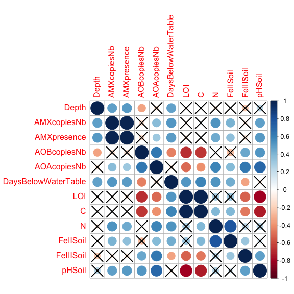
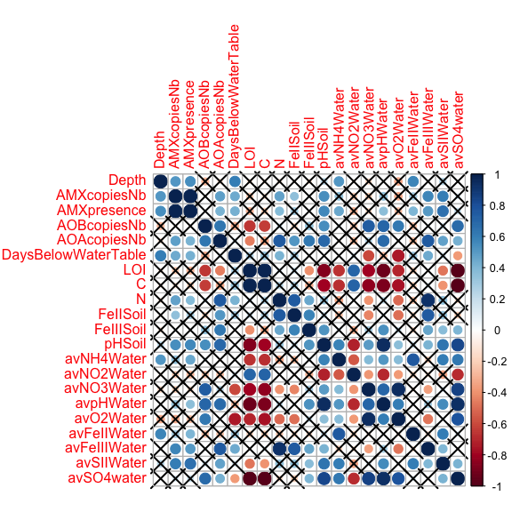
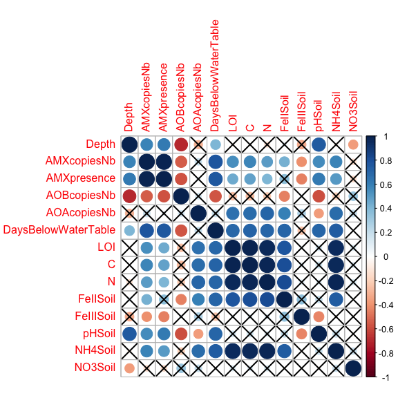
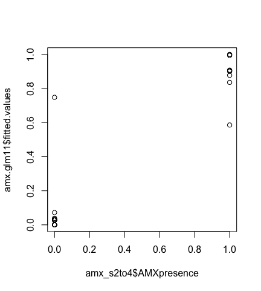
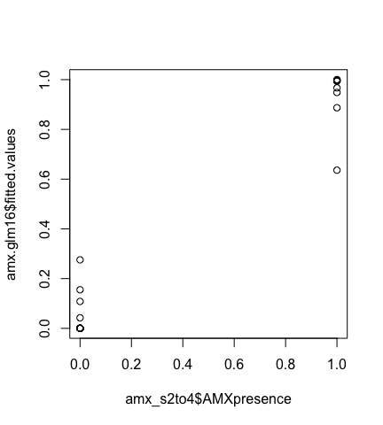
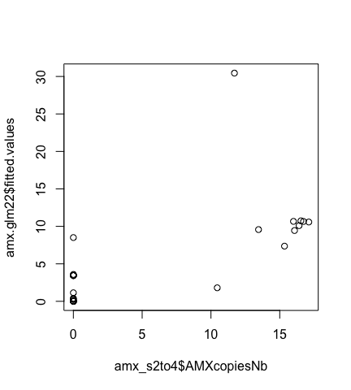
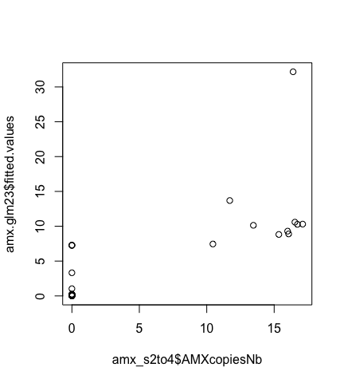
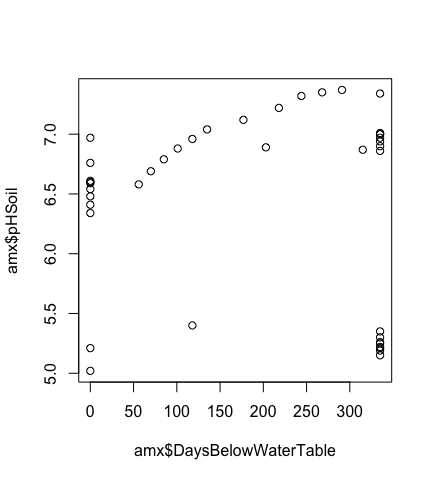
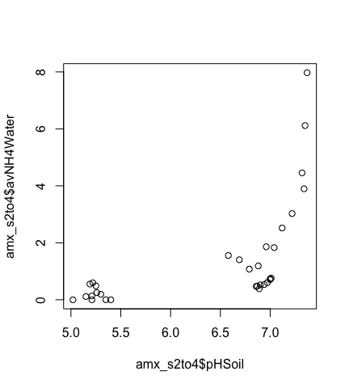
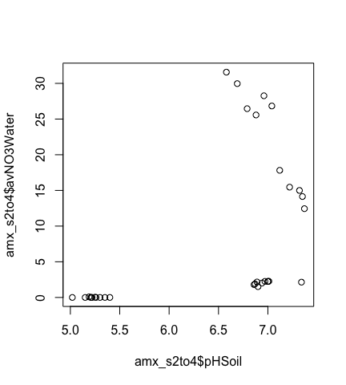

# Script with short output
Alexandre Bagnoud  
06/01/2017  

#### 1) Load the data set into R


```r
amx <- read.csv("amx_matrix.csv", header = TRUE)
```

#### 2) Log-transform abundance data


```r
amx$AMXcopiesNb <- log(amx$AMXcopiesNb + 1)
amx$AOBcopiesNb <- log(amx$AOBcopiesNb + 1)
amx$AOAcopiesNb <- log(amx$AOAcopiesNb + 1)
```

#### 3) Subset complete data sets from the dataframe (without any NAs)


```r
# Soils 1 to 4:
amx_s1to4 <- amx[, 3:14]

# Soils 2 to 4:
amx_s2to4 <- amx[10:41, c(3:14, 17:25)]

# Soils 1 to 3:
amx_s1to3 <- amx[1:30, 3:16]
```

#### 4) Correlation between variables

##### Correlation matrix

Here, we want to see which variables are correlated with ```AMXPresence``` and ```AMXcopiesNb```, in order to try to explain the distribution of anammox bacteria in this soil system.


```r
library(Hmisc)

rcorr(as.matrix(amx[3:25]))
```

* ```AMXpresence``` and ```AMXcopiesNb``` are both correlated with ```DaysBelowWaterTable```, ```pHSoil```, ```N```, ```avNH4Water```, ```avFeIIIWater```, ```avSIIWater```, and ```NH4Soil``` (besides ```avDepth```, and ```AOAcopiesNb```).

The best candidate variables for explaning anammox distribution in this soil system are ```DaysBelowWaterTable```, ```pHSoil``` and ```N```, as they are the most correlated variable with ```AMXpresence``` and ```AMXcopiesNb```. Let's use them to fit a model that explains anammox distribution in this soil system

##### Correlation plots

Correlation plot from these 3 data sets. Non-signifcant correlations (p-value > 0.01) are crossed.


```r
library(corrplot)

# cor.mtest function from:
# http://www.sthda.com/french/wiki/matrice-de-correlation-guide-simple-pour-analyser-formater-et-visualiser

cor.mtest <- function(mat, conf.level = 0.95){
  mat <- as.matrix(mat)
    n <- ncol(mat)
    p.mat <- lowCI.mat <- uppCI.mat <- matrix(NA, n, n)
    diag(p.mat) <- 0
    diag(lowCI.mat) <- diag(uppCI.mat) <- 1
    for(i in 1:(n-1)){
        for(j in (i+1):n){
            tmp <- cor.test(mat[,i], mat[,j], conf.level = conf.level)
            p.mat[i,j] <- p.mat[j,i] <- tmp$p.value
            lowCI.mat[i,j] <- lowCI.mat[j,i] <- tmp$conf.int[1]
            uppCI.mat[i,j] <- uppCI.mat[j,i] <- tmp$conf.int[2]
        }
    }
    return(list(p.mat, lowCI.mat, uppCI.mat))
}

# Soils 1 to 4 (n = 41):
mcor_s1to4 <- cor(amx_s1to4, method = c("pearson"))
res_s1to4 <- cor.mtest(amx_s1to4,0.99)
corrplot(mcor_s1to4, p.mat = res_s1to4[[1]], sig.level=0.05, addrect=6, tl.cex=1)
```

<!-- -->

```r
# Soils 2 to 4 (n = 32):
mcor_s2to4 <- cor(amx_s2to4, method = c("pearson"))
res_s2to4 <- cor.mtest(amx_s2to4,0.99)
corrplot(mcor_s2to4, p.mat = res_s2to4[[1]], sig.level=0.05, addrect=6, tl.cex=1)
```

<!-- -->

```r
# Soils 1 to 3 (n = 30):
mcor_s1to3 <- cor(amx_s1to3, method = c("pearson"))
res_s1to3 <- cor.mtest(amx_s1to3,0.99)
corrplot(mcor_s1to3, p.mat = res_s1to3[[1]], sig.level=0.05, addrect=6, tl.cex=1)
```

<!-- -->

#### 5) Fitting a generalized linear model (GLM) without interactions


```r
# With DaysBelowWaterTable:
amx.glm1 <- glm(AMXpresence~DaysBelowWaterTable,data=amx_s1to4,family=binomial)
summary(amx.glm1)
```

```
## 
## Call:
## glm(formula = AMXpresence ~ DaysBelowWaterTable, family = binomial, 
##     data = amx_s1to4)
## 
## Deviance Residuals: 
##     Min       1Q   Median       3Q      Max  
## -1.1770  -0.5901  -0.1313  -0.1313   1.7515  
## 
## Coefficients:
##                      Estimate Std. Error z value Pr(>|z|)  
## (Intercept)         -4.749941   1.912998  -2.483   0.0130 *
## DaysBelowWaterTable  0.014176   0.006147   2.306   0.0211 *
## ---
## Signif. codes:  0 '***' 0.001 '**' 0.01 '*' 0.05 '.' 0.1 ' ' 1
## 
## (Dispersion parameter for binomial family taken to be 1)
## 
##     Null deviance: 45.554  on 40  degrees of freedom
## Residual deviance: 32.563  on 39  degrees of freedom
## AIC: 36.563
## 
## Number of Fisher Scoring iterations: 6
```

```r
# With pHSoil:
amx.glm2 <- glm(AMXpresence~pHSoil,data=amx_s1to4,family=binomial)
summary(amx.glm2)
```

```
## 
## Call:
## glm(formula = AMXpresence ~ pHSoil, family = binomial, data = amx_s1to4)
## 
## Deviance Residuals: 
##      Min        1Q    Median        3Q       Max  
## -1.80715  -0.47400  -0.00258  -0.00060   1.64348  
## 
## Coefficients:
##             Estimate Std. Error z value Pr(>|z|)  
## (Intercept)  -54.227     21.090  -2.571   0.0101 *
## pHSoil         7.707      3.023   2.549   0.0108 *
## ---
## Signif. codes:  0 '***' 0.001 '**' 0.01 '*' 0.05 '.' 0.1 ' ' 1
## 
## (Dispersion parameter for binomial family taken to be 1)
## 
##     Null deviance: 45.554  on 40  degrees of freedom
## Residual deviance: 24.279  on 39  degrees of freedom
## AIC: 28.279
## 
## Number of Fisher Scoring iterations: 8
```

```r
# With N:
amx.glm3 <- glm(AMXpresence~N,data=amx_s1to4,family=binomial)
summary(amx.glm3)
```

```
## 
## Call:
## glm(formula = AMXpresence ~ N, family = binomial, data = amx_s1to4)
## 
## Deviance Residuals: 
##     Min       1Q   Median       3Q      Max  
## -1.5267  -0.5989  -0.5283  -0.4381   2.2033  
## 
## Coefficients:
##             Estimate Std. Error z value Pr(>|z|)    
## (Intercept)  -2.5408     0.7239  -3.510 0.000448 ***
## N             1.3630     0.5199   2.621 0.008755 ** 
## ---
## Signif. codes:  0 '***' 0.001 '**' 0.01 '*' 0.05 '.' 0.1 ' ' 1
## 
## (Dispersion parameter for binomial family taken to be 1)
## 
##     Null deviance: 45.554  on 40  degrees of freedom
## Residual deviance: 37.972  on 39  degrees of freedom
## AIC: 41.972
## 
## Number of Fisher Scoring iterations: 4
```

All of these 3 variables can significantly explain the presence of anammox bacteria in this soil system.

#### 6) Fitting a generalized linear model (GLM) with interactions

Now let's try to consider interactions between these 3 variables, to see if we can get better models. To do so, the Bayesian version of GLM is used, in order to address the "quasi complete separation problem", which produces huge p-values.


```r
library(arm)

# DaysBelowWaterTable and pHSoil:
amx.glm4 <- bayesglm(AMXpresence~DaysBelowWaterTable*pHSoil,data=amx_s1to4,family=binomial)
summary(amx.glm4)

# DaysBelowWaterTable and N:
amx.glm5 <- bayesglm(AMXpresence~DaysBelowWaterTable*N,data=amx_s1to4,family=binomial)
summary(amx.glm5)

# pHSoil and N:
amx.glm6 <- bayesglm(AMXpresence~pHSoil*N,data=amx_s1to4,family=binomial)
summary(amx.glm6)
```

None of these models is better than the ones including no interactions.

#### 7) Improving ```amx.glm1``` by considering interactions with other variables.

These variables includes ```avNH4Water```, ```avFeIIIWater```, ```avSIIWater```, ```NH4Soil```, which were correlated with ```AMXpresence```, but also ```avNO3Water```, which is a substrate to anammox bacteria.


```r
# DaysBelowWaterTable and avNH4Water:
amx.glm7 <- bayesglm(AMXpresence~DaysBelowWaterTable*avNH4Water,data=amx_s2to4,family=binomial)
summary(amx.glm7)

# DaysBelowWaterTable and avFeIIIWater:
amx.glm8 <- bayesglm(AMXpresence~DaysBelowWaterTable*avFeIIIWater,data=amx_s2to4,family=binomial)
summary(amx.glm8)

# DaysBelowWaterTable and avSIIWater:
amx.glm9 <- bayesglm(AMXpresence~DaysBelowWaterTable*avSIIWater,data=amx_s2to4,family=binomial)
summary(amx.glm9)

# DaysBelowWaterTable and NH4Soil:
amx.glm10 <- bayesglm(AMXpresence~DaysBelowWaterTable*NH4Soil,data=amx_s1to3,family=binomial)
summary(amx.glm10)

# DaysBelowWaterTable and avNO3Water:
amx.glm11 <- bayesglm(AMXpresence~DaysBelowWaterTable*avNO3Water,data=amx_s2to4,family=binomial)
summary(amx.glm11)
```

The last model, the one considering an interaction between ```DaysBelowWaterTable``` and ```avNO3Water```, is better, as the interaction between the two variables is significant and as its AIC value is smaller thant the model with no interaction.

#### 8) Improving ```amx.glm2``` by considering interactions with other variables.

These variables includes ```avNH4Water```, ```avFeIIIWater```, ```avSIIWater```, ```NH4Soil```, which were correlated with ```AMXpresence```, but also ```avNO3Water```, which is a substrate to anammox bacteria.


```r
# pHSoil and avNH4Water:
amx.glm12 <- bayesglm(AMXpresence~pHSoil*avNH4Water,data=amx_s2to4,family=binomial)
summary(amx.glm12)

# pHSoil and avFeIIIWater:
amx.glm13 <- bayesglm(AMXpresence~pHSoil*avFeIIIWater,data=amx_s2to4,family=binomial)
summary(amx.glm13)

# pHSoil and avSIIWater:
amx.glm14 <- bayesglm(AMXpresence~pHSoil*avSIIWater,data=amx_s2to4,family=binomial)
summary(amx.glm14)

# pHSoil and NH4Soil:
amx.glm15 <- bayesglm(AMXpresence~pHSoil*NH4Soil,data=amx_s1to3,family=binomial)
summary(amx.glm15)

# pHSoil and avNO3Water:
amx.glm16 <- bayesglm(AMXpresence~pHSoil*avNO3Water,data=amx_s2to4,family=binomial)
summary(amx.glm16)
```

The last model, the one considering an interaction between ```pHSoil``` and ```avNO3Water```, is better, as the interaction between the two variables is significant and as its AIC value is smaller thant the model with no interaction.

#### 9) Improving ```amx.glm3``` by considering interactions with other variables.

These variables includes ```avNH4Water```, ```avFeIIIWater```, ```avSIIWater```, ```NH4Soil```, which were correlated with ```AMXpresence```, but also ```avNO3Water```, which is a substrate to anammox bacteria.


```r
# N and avNH4Water:
amx.glm17 <- bayesglm(AMXpresence~N*avNH4Water,data=amx_s2to4,family=binomial)
summary(amx.glm17)

# N and avFeIIIWater:
amx.glm18 <- bayesglm(AMXpresence~N*avFeIIIWater,data=amx_s2to4,family=binomial)
summary(amx.glm18)

# N and avSIIWater:
amx.glm19 <- bayesglm(AMXpresence~N*avSIIWater,data=amx_s2to4,family=binomial)
summary(amx.glm19)

# N and NH4Soil:
amx.glm20 <- bayesglm(AMXpresence~N*NH4Soil,data=amx_s1to3,family=binomial)
summary(amx.glm20)

# N and avNO3Water:
amx.glm21 <- bayesglm(AMXpresence~N*avNO3Water,data=amx_s2to4,family=binomial)
summary(amx.glm21)
```

None of these models is better than the original one, i.e. ```amx.glm3```.

#### 10) Which GLM is the best?

Two GLMs explain well the distribution of anammox bacteria in this soil system. They are the following:


```r
library(arm)

# DaysBelowWaterTable and avNO3Water:
amx.glm11 <- bayesglm(AMXpresence~DaysBelowWaterTable*avNO3Water,data=amx_s2to4,family=binomial)
summary(amx.glm11)
```

```
## 
## Call:
## bayesglm(formula = AMXpresence ~ DaysBelowWaterTable * avNO3Water, 
##     family = binomial, data = amx_s2to4)
## 
## Deviance Residuals: 
##      Min        1Q    Median        3Q       Max  
## -1.66190  -0.23669   0.00000   0.02949   1.03368  
## 
## Coefficients:
##                                  Estimate Std. Error z value Pr(>|z|)   
## (Intercept)                    -74.962942  26.386079  -2.841   0.0045 **
## DaysBelowWaterTable              0.213140   0.074832   2.848   0.0044 **
## avNO3Water                      -0.004540   0.113401  -0.040   0.9681   
## DaysBelowWaterTable:avNO3Water   0.007721   0.002907   2.656   0.0079 **
## ---
## Signif. codes:  0 '***' 0.001 '**' 0.01 '*' 0.05 '.' 0.1 ' ' 1
## 
## (Dispersion parameter for binomial family taken to be 1)
## 
##     Null deviance: 39.7495  on 31  degrees of freedom
## Residual deviance:  5.9533  on 28  degrees of freedom
## AIC: 13.953
## 
## Number of Fisher Scoring iterations: 36
```

```r
coefficients(amx.glm11)
```

```
##                    (Intercept)            DaysBelowWaterTable 
##                  -74.962941730                    0.213139817 
##                     avNO3Water DaysBelowWaterTable:avNO3Water 
##                   -0.004539585                    0.007720744
```

```r
plot(amx_s2to4$AMXpresence, amx.glm11$fitted.values)
```

<!-- -->

```r
# pHSoil and avNO3Water:
amx.glm16 <- bayesglm(AMXpresence~pHSoil*avNO3Water,data=amx_s2to4,family=binomial)
summary(amx.glm16)
```

```
## 
## Call:
## bayesglm(formula = AMXpresence ~ pHSoil * avNO3Water, family = binomial, 
##     data = amx_s2to4)
## 
## Deviance Residuals: 
##      Min        1Q    Median        3Q       Max  
## -0.80271   0.00000   0.00000   0.02759   0.95140  
## 
## Coefficients:
##                     Estimate Std. Error z value Pr(>|z|)  
## (Intercept)       -3.863e+02  1.749e+02  -2.208   0.0272 *
## pHSoil             5.639e+01  2.554e+01   2.208   0.0273 *
## avNO3Water        -4.518e-04  1.134e-01  -0.004   0.9968  
## pHSoil:avNO3Water -2.147e-01  1.066e-01  -2.014   0.0440 *
## ---
## Signif. codes:  0 '***' 0.001 '**' 0.01 '*' 0.05 '.' 0.1 ' ' 1
## 
## (Dispersion parameter for binomial family taken to be 1)
## 
##     Null deviance: 39.750  on 31  degrees of freedom
## Residual deviance:  2.654  on 28  degrees of freedom
## AIC: 10.654
## 
## Number of Fisher Scoring iterations: 78
```

```r
plot(amx_s2to4$AMXpresence, amx.glm16$fitted.values)
```

<!-- -->

The same variables interactions can also explain the number of copies of anammox bacteria 16S rRNA gene:


```r
# DaysBelowWaterTable and avNO3Water:
amx.glm22 <- glm(AMXcopiesNb~DaysBelowWaterTable*avNO3Water,data=amx_s2to4,family=poisson)
summary(amx.glm22)
```

```
## 
## Call:
## glm(formula = AMXcopiesNb ~ DaysBelowWaterTable * avNO3Water, 
##     family = poisson, data = amx_s2to4)
## 
## Deviance Residuals: 
##     Min       1Q   Median       3Q      Max  
## -4.1244  -2.6244  -0.2378   1.2675   4.4112  
## 
## Coefficients:
##                                  Estimate Std. Error z value Pr(>|z|)    
## (Intercept)                    -3.387e+01  6.721e+00  -5.039 4.68e-07 ***
## DaysBelowWaterTable             1.048e-01  1.982e-02   5.287 1.25e-07 ***
## avNO3Water                      8.365e-01  2.388e-01   3.503 0.000459 ***
## DaysBelowWaterTable:avNO3Water -9.992e-04  5.730e-04  -1.744 0.081163 .  
## ---
## Signif. codes:  0 '***' 0.001 '**' 0.01 '*' 0.05 '.' 0.1 ' ' 1
## 
## (Dispersion parameter for poisson family taken to be 1)
## 
##     Null deviance: 351.92  on 31  degrees of freedom
## Residual deviance: 137.92  on 28  degrees of freedom
## AIC: Inf
## 
## Number of Fisher Scoring iterations: 7
```

```r
plot(amx_s2to4$AMXcopiesNb, amx.glm22$fitted.values)
```

<!-- -->

```r
# pHSoil and avNO3Water:
amx.glm23 <- glm(AMXcopiesNb~pHSoil*avNO3Water,data=amx_s2to4,family=poisson)
summary(amx.glm23)
```

```
## 
## Call:
## glm(formula = AMXcopiesNb ~ pHSoil * avNO3Water, family = poisson, 
##     data = amx_s2to4)
## 
## Deviance Residuals: 
##     Min       1Q   Median       3Q      Max  
## -3.8180  -0.6422  -0.5247   0.2380   2.1587  
## 
## Coefficients:
##                   Estimate Std. Error z value Pr(>|z|)    
## (Intercept)       -15.3884     2.4441  -6.296 3.05e-10 ***
## pHSoil              2.5993     0.3458   7.517 5.59e-14 ***
## avNO3Water         -2.4686     1.0217  -2.416   0.0157 *  
## pHSoil:avNO3Water   0.3224     0.1393   2.314   0.0207 *  
## ---
## Signif. codes:  0 '***' 0.001 '**' 0.01 '*' 0.05 '.' 0.1 ' ' 1
## 
## (Dispersion parameter for poisson family taken to be 1)
## 
##     Null deviance: 351.920  on 31  degrees of freedom
## Residual deviance:  90.745  on 28  degrees of freedom
## AIC: Inf
## 
## Number of Fisher Scoring iterations: 6
```

```r
plot(amx_s2to4$AMXcopiesNb, amx.glm23$fitted.values)
```

<!-- -->

* ```SoilpH``` and ```DaysBelowWaterTable``` are not correlated, so these two models are not redundant.


```r
plot(amx$DaysBelowWaterTable, amx$pHSoil)
```

<!-- -->

```amx.glm11``` makes sense and suggests that anammox bacteria need both nitrate in the interstitial water (which is used as a susbtrate), and water-saturating condition, as these microorganisms seems to ....

The second model ```amx.glm16```, makes less sense, because it is not clear how pH can affect anammox bacteria. This variable appears to be an important factor because in the GLM, only Soils 2 to 4 are considered, due to the lack of ```avNO3Water``` observations in Soil 1. The consequence of this is that low pH soil samples, which correspond to the peat pog interstial water samples, are the ones that do not harbour anammox. But to us, the reason for the lack of anammox bacteria in Soil 4 is not the low pH, but the low concentration of inorganic N-form in the interstitial water. which are to water samples with low NH4+ and NO3- concentrations, due to the presence of the peatbog. In other words, low soil pH values reflects low NH4+ and NO3- concentrations due to sampling effect, which in turn explain why anammox bacteria are absent from Soil 4.


```r
plot(amx_s2to4$pHSoil, amx_s2to4$avNH4Water)
```

<!-- -->

```r
plot(amx_s2to4$pHSoil, amx_s2to4$avNO3Water)
```

<!-- -->

For all of these reasons, ```amx.glm11``` is considered as the best model explaining the distribution of anammox bacteria in this soil system and shows that they need both sufficient nitrate concentration in interstial water, and long-term water-saturating conditions.


#### 11) Generalized linear mixed model (GLMM)

Because observations are not independant (they originate from 3 soils profiles), one can use generalized linear mixed model (GLMM), which takes this into account to build more powerful models.


```r
library(glmm)

# avNO3Water:
amx.glmm1 <- glmm(AMXpresence ~ 0 + avNO3Water,
                 random = list(AMXpresence ~ 0 + amx$Soil[10:41]), data = amx_s2to4, family.glmm=binomial.glmm,
                 varcomps.names = c("Soil"), m = 10^5)
summary(amx.glmm1)

# DaysBelowWaterTable:
amx.glmm2 <- glmm(AMXpresence ~ 0 + DaysBelowWaterTable,
                 random = list(AMXpresence ~ 0 + Soil), data=amx, family.glmm=binomial.glmm,
                 varcomps.names = c("Soil"), m = 10^5)
summary(amx.glmm2)


# DaysBelowWaterTable and avNO3Water:
amx.glmm3 <- glmm(AMXpresence ~ 0 + avNO3Water:DaysBelowWaterTable,
                 random = list(AMXpresence ~ 0 + amx$Soil[10:41]), data=amx_s2to4, family.glmm=binomial.glmm,
                 varcomps.names = c("Soil"), m = 10^5)
summary(amx.glmm3)
```

Here, we clearly see that the random effects are not significant. This means that GLM are good enough to explain anammox distribution in these soils and that GLMM are not needed.
